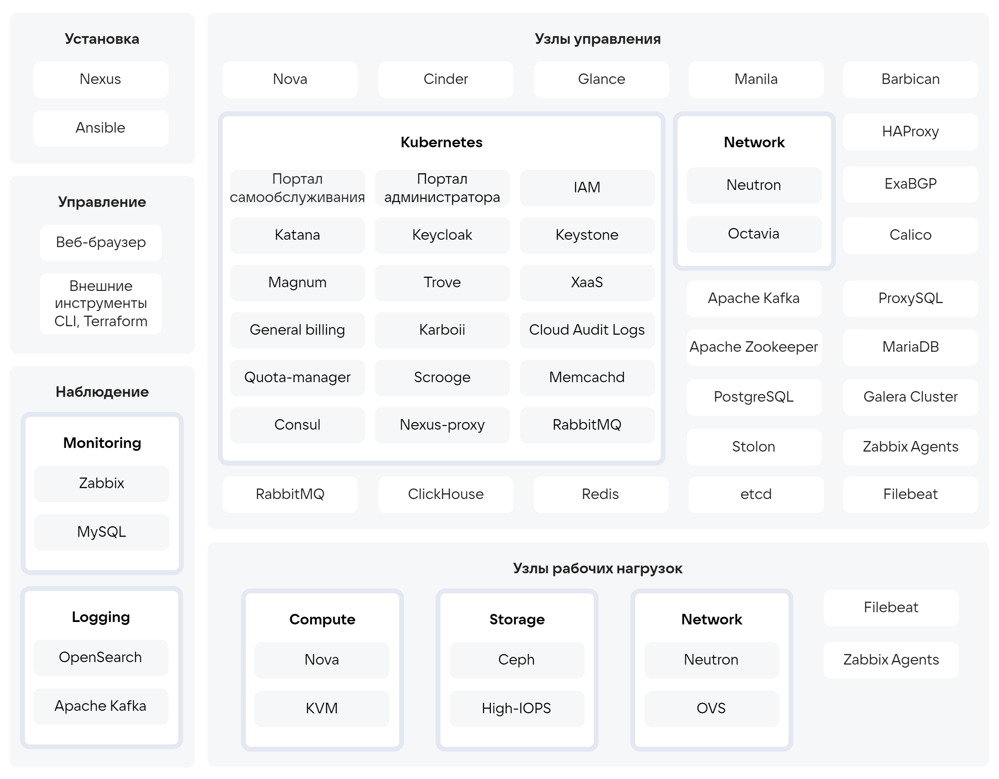

# {heading(Компонентный состав {var(sys2)})[id=arch_components_list]}

В состав {var(sys2)} входит базовое и служебное ПО, которое устанавливается на операционную систему РЕД ОС 7.3.

Базовое ПО:

* Nova — реализует функции управления виртуальными машинами (ВМ). Обеспечивает размещение ВМ на вычислительных узлах и управление жизненным циклом ВМ. Предоставляет возможность:

   * Использовать шаблоны/типы ВМ, образы дисков.
   * Настраивать агрегацию вычислительных узлов, правил распределения нагрузки.
   * Миграции ВМ, резервного копирования и восстановления.

* Cinder — реализует функции оркестрации конечных решений по блочному хранению данных. Позволяет создавать виртуальные диски и управлять их жизненным циклом.
* Neutron — реализует функции управления виртуальной сетевой инфраструктурой. Обеспечивает управление жизненным циклом виртуальных сетей, подсетей, виртуальных маршрутизаторов, сетевых интерфейсов виртуальных машин и групп безопасности.
* Octavia — реализует сервис управляемых балансировщиков нагрузки (LBaaS).
* Glance — реализует функции ведения и предоставления каталога образов виртуальных машин.
* Barbican — реализует функции безопасного хранения и предоставления ключей и сертификатов.
* Manila — реализует функции создания и подключения удалённых файловых хранилищ к ВМ по протоколам CIFS или NFS.
* Magnum — реализует функции управляемых контейнеров (Kubernetes aaS).
* Trove — реализует сервис управляемых баз данных (DBaaS).
* XaaS — реализует функции предоставления aaS-ресурсов (приложения, API, данные) без привязки к модели развёртывания в виде магазина приложений Marketplace.
* Scrooge — компонент, созданный {var(company)}. Выполняет функции начисления и тарификации.
* General Billing — компонент, созданный {var(company)}. Обеспечивает управление балансом и генерацию отчётов по биллингу.
* Quota manager — реализует функции управления квотами.
* IAM — компонент, созданный {var(company)}. Обеспечивает аутентификацию и авторизацию пользователей, управление правами доступа.
* Keycloak — обеспечивает хранение учётных записей пользователей и интеграцию с внешними службами каталогов.
* Keystone — реализует аутентификацию взаимодействия между компонентами {var(sys2)}.
* Karboii — реализует управление планами резервного копирования. Обеспечивает выполнение полного и инкрементного резервного копирования ВМ, агентское резервное копирование баз данных (DBaaS).
* Zabbix — реализует мониторинг состояния {var(sys2)}.
* OpenSearch — реализует хранение журналов компонентов {var(sys2)}.
* Ansible — используется для разворачивания и настройки компонентов {var(sys2)}.
* Nexus — репозиторий для хранения установочных пакетов и образов компонентов {var(sys2)}.

Служебное ПО:

* Ceph — программная кластеризованная СХД. Используется для хранения виртуальных дисков и образов виртуальных машин.
* High-IOPS — реализует хранилище, подключаемое по протоколу iSCSI. Представляет собой LVM-mirror поверх двух NVME- или SSD-дисков внутри одного сервера. Устойчив к отказу NVMe–SSD.
* KVM — гипервизор.
* Galera Cluster — кластеры СУБД MariaDB. Используется для хранения данных о сущностях {var(sys2)}.
* MariaDB — системная СУБД. Используется частью компонентов {var(sys2)} для хранения данных о сущностях {var(sys2)}.
* PostgreSQL — системная СУБД. Используется частью компонентов {var(sys2)} для хранения данных о сущностях {var(sys2)}.
* ProxySQL — L-7 прокси для работы с MariaDB.
* ExaBGP — сервис, реализующий функции с использованием протокола динамической маршрутизации на базе BGP. Используется HAProxy.
* ClickHouse — системная СУБД. Используется частью компонентов {var(sys2)} для хранения данных о сущностях {var(sys2)}.
* Redis — резидентная NoSQL СУБД. Используется компонентом Magnum.
* Stolon — оркестратор, обеспечивающий высокую доступность кластеров PostgreSQL.
* RabbitMQ — брокер очередей. Используется для обмена данными между компонентами {var(sys2)}.
* Apache Kafka — выполняет буферизацию при сборе данных журналов компонентов {var(sys2)}.
* etcd — распределённая key-value база данных.
* Apache Zookeeper — служба для координации распределённых транзакций. Используется Apache Kafka.
* Consul — служба обнаружения сервисов на основе DNS и проверки их доступности.
* Calico — плагин Kubernetes для управления сетевыми политиками. Используется служебным Kubernetes.
* HAProxy — балансировщик нагрузки для TCP и HTTP-приложений.
* Nexus-proxy — proxy-репозиторий для ускорения загрузки компонентов. Используется компонентом Trove.
* Kubernetes — оркестратор. Используется для управления контейнерами, в которых запущена часть компонентов {var(sys2)}.
* Docker — контейнеризатор приложений.
* OVS — программный коммутатор. Используется для организации сети {var(sys2)}.

Компонентный состав {var(sys2)} приведён на {linkto(#pic_arch_components)[text=рисунке %number]}.

{caption(Рисунок {counter(pic)[id=numb_pic_arch_components]} — Компоненты {var(sys2)})[align=center;position=under;id=pic_arch_components;number={const(numb_pic_arch_components)}]}

{/caption}