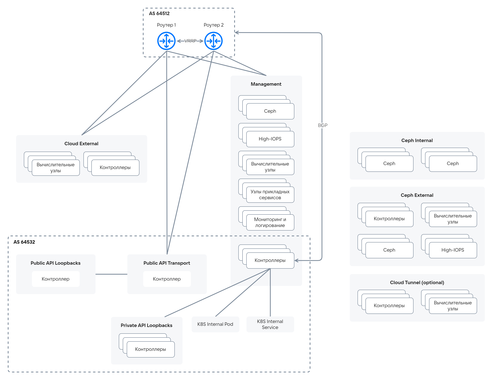

# {heading(Сети {var(sys2)})[id=arch_network]}

## {heading(Используемые сети)[id=networks_used]}

Для работы {var(sys2)} требуется набор маршрутизируемых и не маршрутизируемых сетей. Общая схема архитектуры сети приведена на {linkto(#pic_arch_network)[text=рисунке %number]}.

{caption(Рисунок {counter(pic)[id=numb_pic_arch_network]} — Общая схема архитектуры сети)[align=center;position=under;id=pic_arch_network;number={const(numb_pic_arch_network)}]}
{params[noBorder=true]}
{/caption}

Сетевым службам требуются изолированные каналы связи, отделенные от других сетей. Такое разделение сетей обосновано необходимостью разделить потоки данных для обеспечения производительности и информационной безопасности {var(sys2)}.

Набор необходимых сетей приведен в {linkto(#tab_network_list)[text=таблице %number]}.

{caption(Таблица {counter(table)[id=numb_tab_network_list]} — Список сетей {var(system)})[align=right;position=above;id=tab_network_list;number={const(numb_tab_network_list)}]}
[cols="3,5,3,4", options="header"]
|===
|Название
|Описание
|Требуется маршрутизация
|Доступ

|Management
|Основная сеть управления. Используется для получения доступа администраторов к адресам Private API Loopbacks, а также для межкомпонентного взаимодействия
| 
|Администраторам

|Private API Loopbacks
|Пул Loopback-адресов для межкомпонентного взаимодействия
| 
| 

|Public API Transport (Portal)
|Сеть для доступа пользователей к адресам Public API Loopbacks
| 
|Пользователям

|Public API Loopbacks
|Пул Loopback-адресов для доступа пользователей. Для работы PaaS-сервисов необходим доступ из сети Cloud External. Если ВМ развернута во внутренней сети, необходимо использовать виртуальный роутер с NAT в сеть Cloud External
| 
|Пользователям

|K8s Internal
|Адреса для внутренних нужд служебного кластера Kubernetes в пределах серверов управления: подсети, которые никогда не будут конфликтовать с другими подсетями в корпоративной сети. Доступ к подам из других сервисов может быть предоставлен посредством передачи маршрутов на шлюз или выдачи адреса сервису (при возможности)
| 
| 

|Cloud Tunnel
|Транспортная сеть для VxLAN-туннелей, используется опционально
| 
| 

|Cloud External
|Сеть для взаимодействия между {var(sys5)} и внешними сетями. Может быть несколько в зависимости от требований Заказчика
| 
|Пользователям

|Сeph External
|Сеть для доступа к данным Ceph и High-IOPS
| 
| 

|Сeph Internal
|Кластерная сеть Ceph
| 
| 
|===
{/caption}

Состав сетей может меняться в зависимости от набора поставки {var(sys2)}. Например, при наличии соответствующих требований может быть несколько сетей класса Cloud External, в частности для взаимодействия с различными производственными средами (Dev/Test/Prod). Внешние сети могут расширяться двумя способами:

* Создание новых External-сетей (предпочтительный способ).
* Добавление новых подсетей в существующую External-сеть.

В зависимости от наличия выделенных сетевых узлов сетевые схемы могут отличаться, как показано на {linkto(#pic_arch_network_diagrams_nonet)[text=рисунке %number]} и {linkto(#pic_arch_network_diagrams_withnet)[text=рисунке %number]}.

{caption(Рисунок {counter(pic)[id=numb_pic_arch_network_diagrams_nonet]} — Сетевая схема без выделенных сетевых узлов)[align=center;position=under;id=pic_arch_network_diagrams_nonet;number={const(numb_pic_arch_network_diagrams_nonet)}]}
{params[noBorder=true]}
{/caption}

{caption(Рисунок {counter(pic)[id=numb_pic_arch_network_diagrams_withnet]} — Сетевая схема с выделенными сетевыми узлами)[align=center;position=under;id=pic_arch_network_diagrams_withnet;number={const(numb_pic_arch_network_diagrams_withnet)}]}
{params[noBorder=true]}
{/caption}

## {heading(Использование маршрутов /32 для виртуальных машин)[id=using_routes_32]}

В {var(system)} 4.2 используются /32 анонсы адресов виртуальных машин, для возможности миграции ВМ между площадками и/или инсталляциями {var(sys2)} с сохранением IPv4 адреса ВМ.

Пример: когда в проекте 3 экземпляра ВМ, которые доступны снаружи и взаимодействуют между собой, можно поочередно перенести каждый экземпляр из одного дата центра в другой, и экземпляры ВМ продолжат взаимодействовать между собой на каждом шаге переноса каждого экземпляра ВМ.

Маршрутизация между сетями не требует фильтрации центральной фермой МСЭ. Если сети имеют разные уровни доверия, они будут принадлежать разным зонам безопасности и потребуют кроме маршрутизации еще и фильтрацию на центральной ферме МСЭ. Зона безопасности будет связана с определенным VRF в сети передачи данных.

<info>

Зона безопасности — совокупность сетей, которые имеют одинаковый уровень доверия.

</info>

Чтобы воспользоваться функционалом миграции ВМ при проектировании таких инсталляций:

1. Определите:

   1. Количество зон безопасности. От их количества будет зависеть количество установленных BGP соседств для анонса /32 маршрутов.
   1. Раскладку номеров автономных систем для зон безопасности. В общем случае каждая зона безопасности может иметь свою пару автономных систем, одна автономная система на стороне {var(sys2)}, вторая на стороне сети. В предельном случае автономная система для всех зон безопасности сети и {var(sys2)} может быть одна.
   1. Количество вычислительных, сетевых и управляющих узлов.
   1. Размерность транспортной сети исходя из определенного количества вычислительных и сетевых узлов. Вычислительный и сетевой узел получат из этой сети адрес, который будет являться next-hop для анонсов /32 адресов в этой зоне безопасности.

1. Учтите, что:
   1. Транспортная сеть назначается для каждой зоны безопасности.
   1. Для отказоустойчивости количество установленных соседств BGP в одной зоне безопасности должно быть не менее двух.

Заполните таблицу паспорта по примеру, приведенному в {linkto(#tab_using_routes_32)[text=таблице %number]}.

{caption(Таблица {counter(table)[id=numb_tab_using_routes_32]} — Пример заполнения паспорта)[align=right;position=above;id=tab_using_routes_32;number={const(numb_tab_using_routes_32)}]}
[cols="1,3,2,2,3,3,3,3", options="header"]
|===
| <!--- В ТАБЛИЦЕ НЕ РАБОТАЮТ ПУСТЫЕ ЯЧЕЙКИ  --->
|Зона безопасности
|AS сети
|AS облака
|Транспортная сеть
|Шлюз транспортной сети
|Peer сети (роутер)
|Peer облака (NBGP)

.2+|1
.2+|security_zone1
.2+|65000
.2+|65001
.2+|192.168.0.0/24
.2+|192.168.0.1
|192.168.0.1
|192.168.0.3

|192.168.0.2
|192.168.0.4
|===
{/caption}

Требования к сети и инсталляциям:

1. Сеть передачи данных, обеспечивающая связность /32 маршрутов между разными площадками, должна обеспечивать связность на L3 уровне.
1. Если на площадках развернуты независимые инсталляции {var(sys2)}, при переезде адреса /32 с исходной площадки на целевую, необходимо убедиться, что в целевой {var(sys3)} адрес /32 не привязан к существующим в целевой {var(sys3)} портам.

Примеры схем трафика North-South и East-West до и после переезда адреса приведены на следующих рисунках:

* Схема трафика North-South до переезда адреса — {linkto(#pic_arch_net_before_NS_traf)[text=рисунок %number]}.

    {caption(Рисунок {counter(pic)[id=numb_pic_arch_net_before_NS_traf]} — Схема трафика North-South до переезда адреса)[align=center;position=under;id=pic_arch_net_before_NS_traf;number={const(numb_pic_arch_net_before_NS_traf)}]}
    {params[noBorder=true]}
    {/caption}

* Схема трафика North-South после переезда адреса — {linkto(#pic_arch_net_after_NS_traf)[text=рисунок %number]}.

    {caption(Рисунок {counter(pic)[id=numb_pic_arch_net_after_NS_traf]} — Схема трафика North-South после переезда адреса)[align=center;position=under;id=pic_arch_net_after_NS_traf;number={const(numb_pic_arch_net_after_NS_traf)}]}
    {params[noBorder=true]}
    {/caption}

* Схема трафика East-West до переезда адреса — {linkto(#pic_arch_net_before_EW_traf)[text=рисунок %number]}.

    {caption(Рисунок {counter(pic)[id=numb_pic_arch_net_before_EW_traf]} — Схема трафика East-West до переезда адреса)[align=center;position=under;id=pic_arch_net_before_EW_traf;number={const(numb_pic_arch_net_before_EW_traf)}]}
    {params[noBorder=true]}
    {/caption}

* Схема трафика East-West после переезда адреса — {linkto(#pic_arch_net_after_EW_traf)[text=рисунок %number]}.

    {caption(Рисунок {counter(pic)[id=numb_pic_arch_net_after_EW_traf]} — Схема трафика East-West после переезда адреса)[align=center;position=under;id=pic_arch_net_after_EW_traf;number={const(numb_pic_arch_net_after_EW_traf)}]}
    {params[noBorder=true]}
    {/caption}