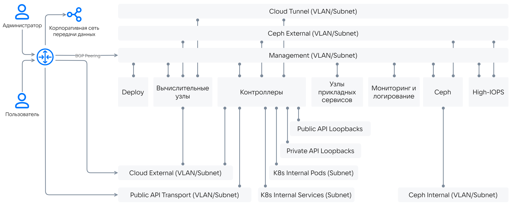
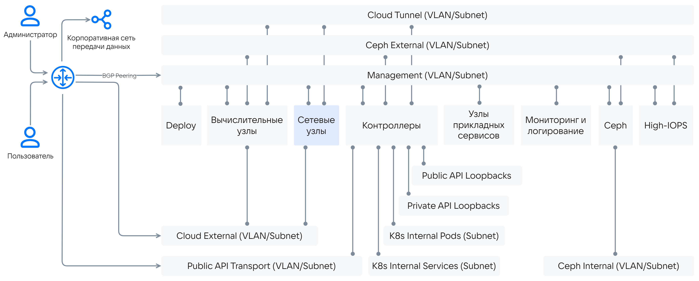

# {heading(Сети {var(sys2)})[id=arch_network]}

Для работы {var(sys2)} требуется набор маршрутизируемых и не маршрутизируемых сетей. Общая схема архитектуры сети приведена на {linkto(#pic_arch_network)[text=рисунке %number]}.

{caption(Рисунок {counter(pic)[id=numb_pic_arch_network]} — Общая схема архитектуры сети)[align=center;position=under;id=pic_arch_network;number={const(numb_pic_arch_network)}]}

{/caption}

Сетевым службам требуются изолированные каналы связи, отделённые от других сетей. Такое разделение сетей обосновано необходимостью разделить потоки данных для обеспечения производительности и информационной безопасности {var(sys2)}.

Набор необходимых сетей приведён в {linkto(#tab_network_list)[text=таблице %number]}.

{caption(Таблица {counter(table)[id=numb_tab_network_list]} — Список сетей {var(system)})[align=right;position=above;id=tab_network_list;number={const(numb_tab_network_list)}]}
[cols="3,5,3,4", options="header"]
|===
|Название
|Описание
|Требуется маршрутизация
|Доступ

|Management
|Основная сеть управления. Используется для получения доступа администраторов к адресам Private API Loopback, а также для межкомпонентного взаимодействия
|Да
|Администраторам

|Private API Loopback
|Пул Loopback-адресов для межкомпонентного взаимодействия.
|Нет
|Нет

|Public API Transport (Portal)
|Сеть для доступа пользователей к адресам Public API Loopback
|Да
|Пользователям

|Public API Loopback
|Пул Loopback-адресов для доступа пользователей
|Нет
|Пользователям

|K8s Internal
|Адреса для внутренних нужд служебного кластера Kubernetes в пределах серверов управления: подсети, которые никогда не будут конфликтовать с другими подсетями в корпоративной сети. Доступ к подам из других сервисов может быть предоставлен посредством передачи маршрутов на шлюз или выдачи адреса сервису (при возможности)
|Нет
|Нет

|Cloud Tunnel
|Транспортная сеть для VxLAN-туннелей, используется опционально
|Нет
|Нет

|Cloud External
|Сеть для взаимодействия между {var(sys5)} и внешними сетями. Может быть несколько в зависимости от требований Заказчика
|Да
|Пользователям

|Сeph External
|Сеть для доступа к данным Ceph и High-IOPS
|Нет
|Нет

|Сeph Internal
|Кластерная сеть Ceph
|Нет
|Нет
|===
{/caption}

Состав сетей может меняться в зависимости от набора поставки {var(sys2)}. Например, при наличии соответствующих требований может быть несколько сетей класса Cloud External, в частности для взаимодействия с различными производственными средами (Dev/Test/Prod). Внешние сети могут расширяться двумя способами:

* Создание новых External-сетей (предпочтительный способ).
* Добавление новых подсетей в существующую External-сеть.

В зависимости от наличия выделенных сетевых узлов сетевые схемы могут отличаться, как показано на {linkto(#pic_arch_network_diagrams_nonet)[text=рисунке %number]} и {linkto(#pic_arch_network_diagrams_withnet)[text=рисунке %number]}.

{caption(Рисунок {counter(pic)[id=numb_pic_arch_network_diagrams_nonet]} — Сетевая схема без выделенных сетевых узлов)[align=center;position=under;id=pic_arch_network_diagrams_nonet;number={const(numb_pic_arch_network_diagrams_nonet)}]}

{/caption}

{caption(Рисунок {counter(pic)[id=numb_pic_arch_network_diagrams_withnet]} — Сетевая схема с выделенными сетевыми узлами)[align=center;position=under;id=pic_arch_network_diagrams_withnet;number={const(numb_pic_arch_network_diagrams_withnet)}]}

{/caption}