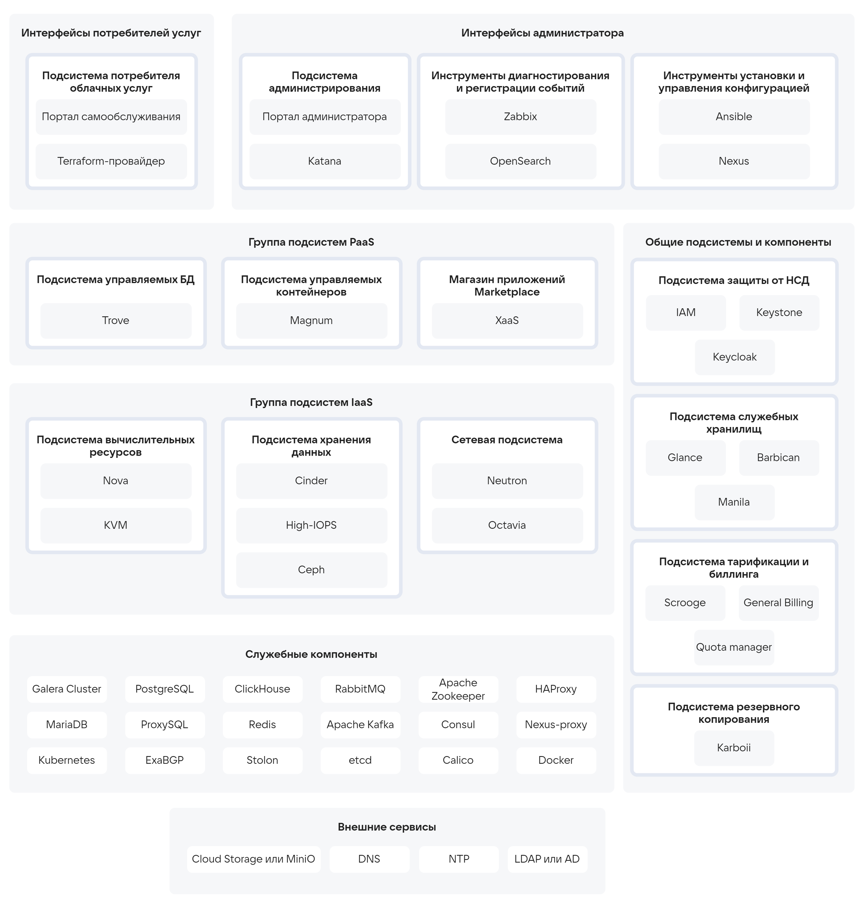

# {heading(Функциональные подсистемы {var(sys2)})[id=arch_subsystems_list]}

Для удобства представления функции {var(sys2)} разделены на следующие функциональные подсистемы:

* Подсистема потребителя облачных услуг.
* Подсистема администрирования.
* Подсистема вычислительных ресурсов.
* Подсистема хранения данных.
* Сетевая подсистема.
* Подсистема управляемых баз данных.
* Подсистема управляемых контейнеров.
* Подсистема облачных приложений Marketplace.
* Подсистема тарификации и биллинга.
* Подсистема резервного копирования.
* Подсистема служебных хранилищ.
* Подсистема защиты от НСД.

Функциональные подсистемы {var(sys2)} приведены на {linkto(#pic_arch_subsystem)[text=рисунке %number]}.

{caption(Рисунок {counter(pic)[id=numb_pic_arch_subsystem]} — Функциональные подсистемы {var(sys2)})[align=center;position=under;id=pic_arch_subsystem;number={const(numb_pic_arch_subsystem)}]}

{/caption}

Функционирование {var(sys2)} зависит от следующих внешних сервисов:

* Cloud Storage или MiniO — объектное хранилище S3 для резервного копирования, Магазина приложения Marketplace и Подсистемы управляемых БД для развёртывания экземпляров СУБД в реплицируемых и кластерных конфигурациях.
* DNS — служба доменных имён, необходима для корректного сетевого взаимодействия между компонентами {var(sys2)} и доступа к управляющим интерфейсам.
* NTP — служба точного времени, необходима для синхронизации времени на серверах {var(sys2)}.
* LDAP или AD — используется в качестве единой базы пользователей и групп для аутентификации.
