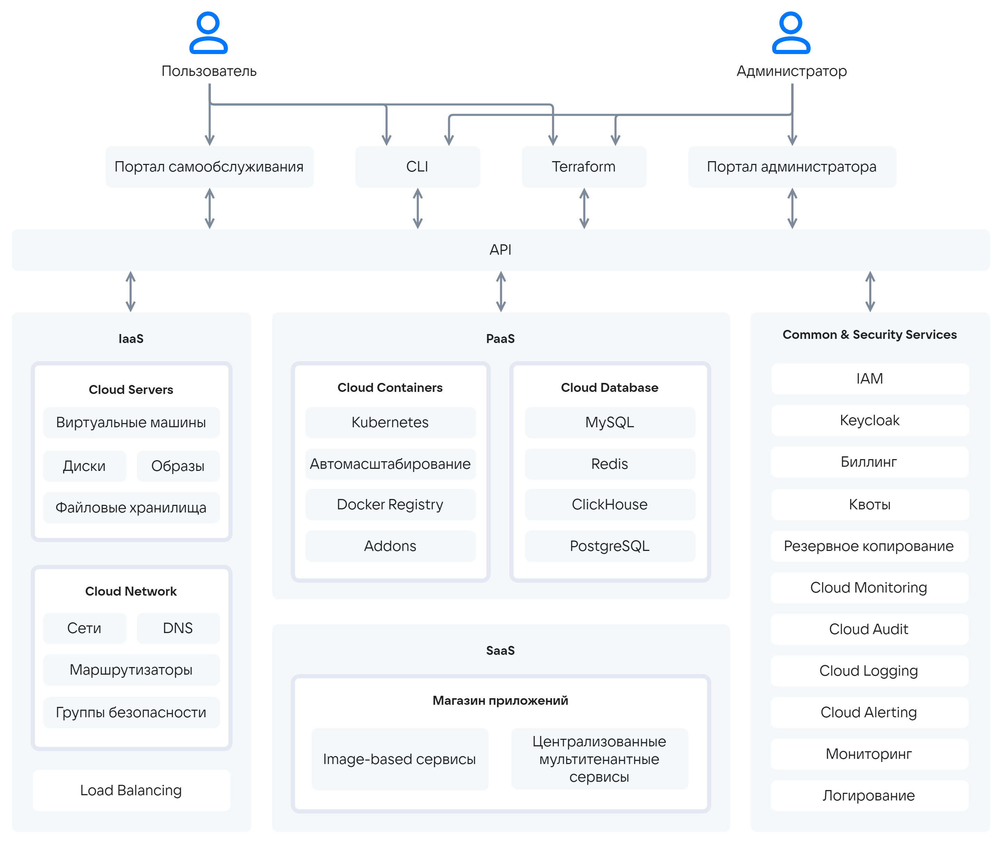
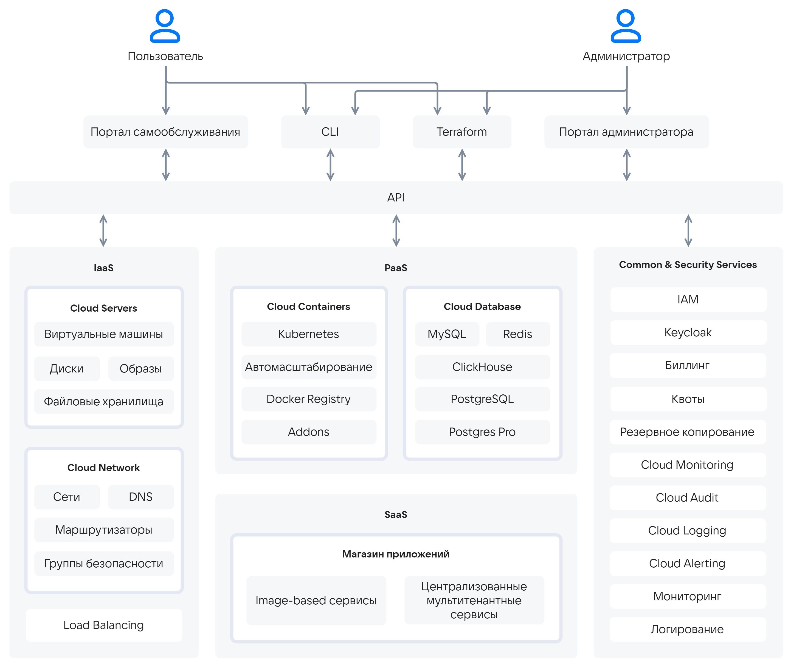

# {heading(Описание архитектуры {var(sys2)})[id=architecture]}

Архитектура {var(sys2)} базируется на следующих группах сервисов:

* IaaS:

  * Cloud Servers — позволяет управлять вычислительными ресурсами Платформы, создавать и управлять виртуальными машинами, виртуальными дисками, образами и файловыми хранилищами.
  * Cloud Network — обеспечивает сетевое взаимодействие в рамках выбранного проекта. Включает в себя сети и подсети, разрешение имен в проектных сетях, маршрутизацию и группы безопасности.
  * Load Balancing — реализует сервис балансировки нагрузки.

* PaaS:

  * Cloud Containers — позволяет создавать и управлять кластерами Kubernetes.
  * Cloud Databases — предоставляет масштабируемые СУБД: MySQL, PostgreSQL,{ifdef(pg)} Postgres Pro,{/ifdef} ClickHouse, Redis.

* SaaS:

   * XaaS — позволяет публиковать и развертывать Image-based и мультитенантные прикладные сервисы в магазине приложений Marketplace.

* Common & Security services:

  * IAM — управляет идентификацией и авторизацией сервисов, пользователей и администраторов {var(sys2)}.
  * Keycloak — обеспечивает хранение учетных записей пользователей и интеграцию с внешними службами каталогов.
  * Биллинг — отвечает за учет использования ресурсов {var(sys2)} и контроль расходов.
  * Квоты — обеспечивает функции управления квотами.
  * Cloud Monitoring — предназначен для мониторинга полезной нагрузки в рамках проекта.
  * Cloud Logging — предназначен для журналирования полезной нагрузки в рамках проекта.
  * Cloud Alerting — предназначен для настройки оповещений об изменении ключевых метрик в работе пользовательской нагрузки.
  * Cloud Audit — предназначен для сохранения и просмотра событий безопасности в рамках проекта.
  * Резервное копирование — предназначено для управления планами резервного копирования ВМ и управляемых СУБД.
  * Мониторинг — реализует мониторинг состояния {var(sys2)}.
  * Логирование — реализует хранение журналов компонентов {var(sys2)}.

Общая схема сервисов приведена на {linkto(#pic_arch_general_architecture)[text=рисунке %number]}.

{ifdef(box)}
{caption(Рисунок {counter(pic)[id=numb_pic_arch_general_architecture]} — Общая схема сервисов)[align=center;position=under;id=pic_arch_general_architecture;number={const(numb_pic_arch_general_architecture)}]}
{params[noBorder=true]}
{/caption}
{/ifdef}

{ifdef(pg)}
{caption(Рисунок {counter(pic)[id=numb_pic_arch_general_architecture]} — Общая схема сервисов)[align=center;position=under;id=pic_arch_general_architecture;number={const(numb_pic_arch_general_architecture)}]}
{params[noBorder=true]}
{/caption}
{/ifdef}

Управление облачными сервисами выполняется с помощью API. Пользователи и администраторы взаимодействуют с API через один или несколько инструментов:

* Портал самообслуживания.
* Портал администратора.
* CLI.
* Terraform-провайдер.
