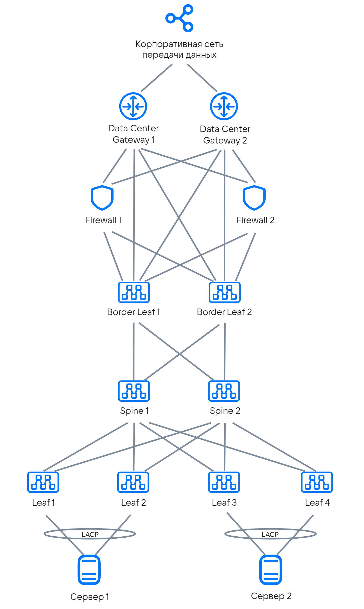
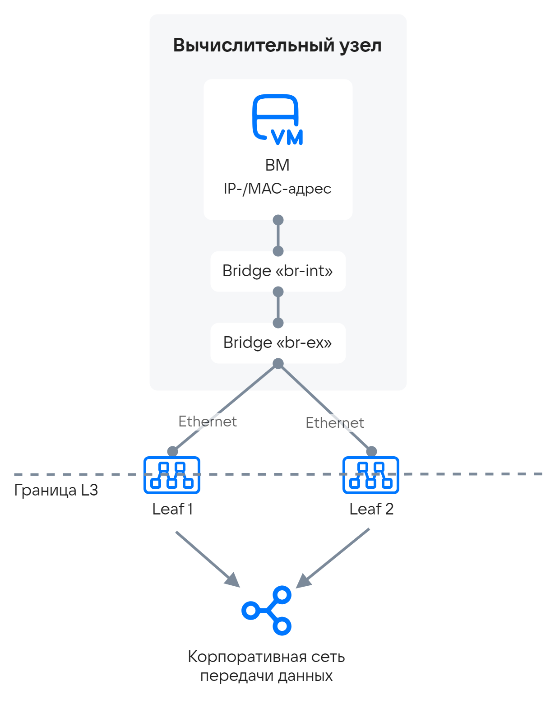
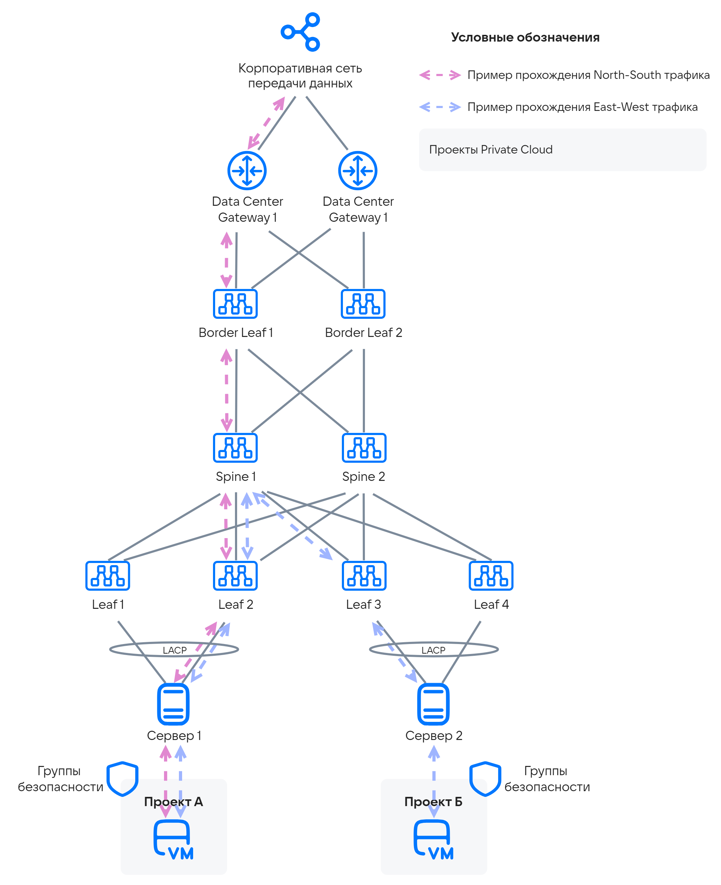
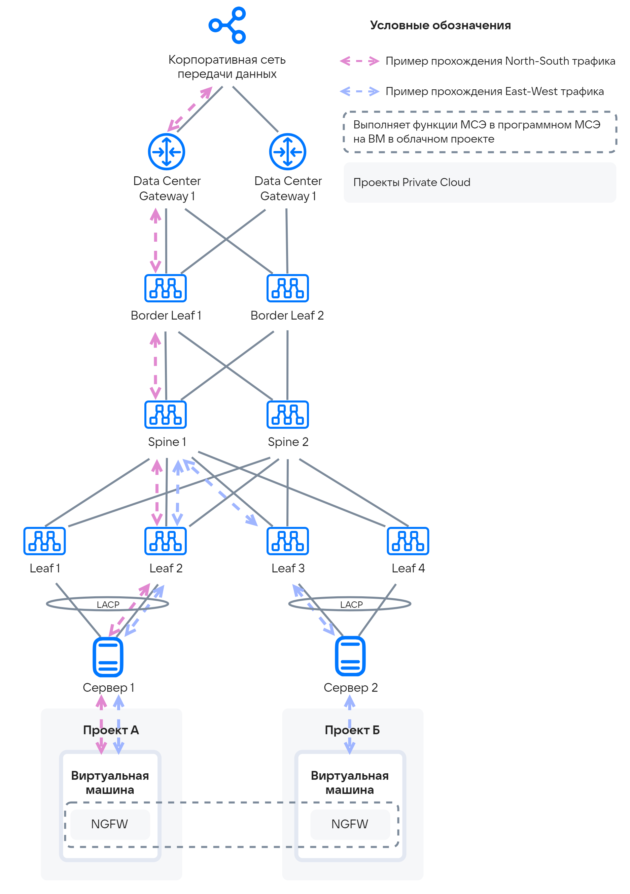

# {heading(Подключение облака к КСПД)[id=design_cloud_connection]}

Сетевая инфраструктура для размещения {var(sys2)} должна быть подготовлена соответствующим образом: должны быть созданы все сети, описанные в разделе {linkto(../../architecture_main/arch_network#arch_network)[text=%text]}. Сетям должны соответствовать IP-адресация с необходимыми масками, VLAN, должны быть выделены пулы для IP Loopback и служебного Kubernetes.

<!--- //todo последнее предложение нужно перефразировать -->

Подготовка сетевой инфраструктуры решает следующие задачи:

* Бесшовная интеграция.
* Изоляция управляющих и рабочих нагрузок.
* Гибкость управления.

Каждая схема, рассмотренная ниже, является типовой для {var(sys2)}, оптимизированной для удобства поддержки и дальнейшего масштабирования.

## {heading(Типовая схема сети ЦОД)[id=connection_typical_data_center_network_diagram]}

Для подключения к КСПД используется:

* Трёх- или пятишаговая CLOS Spine-Leaf фабрика.
* Коммутаторы Border-Leaf для North-South трафика.
* МСЭ-ферма для фильтрации межзонного трафика.
* Data Center Gateway для связи между ЦОД и с внешними сетями.
* Серверы подключаются как по L2, так и по L3 (зависит от требований Заказчика).

Пример трёхшаговой Spine-Leaf фабрики приведён на {linkto(#pic_design_cloud_connection_spine_leaf)[text=рисунке %number]}.

{caption(Рисунок {counter(pic)[id=numb_pic_design_cloud_connection_spine_leaf]} — Пример схемы трёхшаговой Spine-Leaf фабрики)[align=center;position=under;id=pic_design_cloud_connection_spine_leaf;number={const(numb_pic_design_cloud_connection_spine_leaf)}]}
{params[width=60%]}
{/caption}

Сетевая фабрика должна соответствовать следующим требованиям:

* Коммутаторы Leaf — поддержка BGP, EVPN-VXLAN (RFC 8365), VxLAN, MC-LAG.
* Пропускная способность коммутаторов Leaf — 25 Гбит/с на порт подключения серверов, 100 Гбит/с на порт подключения к Spine.
* Коммутаторы Spine — поддержка BGP, EVPN-VXLAN.
* Пропускная способность коммутаторов Spine — 100 Гбит/с на порт.
* Коммутаторы Border Leaf — поддержка BGP, EVPN-VXLAN, VxLAN.
* Firewall — поддержка BGP.
* Data Center Gateway — поддержка L3VPN, EVPN.

## {heading(Выбор интеграции с КСПД)[id=connection_selecting_integration]}

### {heading(Классическая интеграция с КСПД)[id=connection_classic_integration]}

Данный вариант выбирается в случае, если не известны параметры подлежащей сети (сетевой фабрики).

В качестве подключения используется MC-LAG или любое другое отказоустойчивое подключение по L2, согласованное с Заказчиком. При этом для {var(sys2)} используются типы сетей типа VxLAN и типа VLAN. Маршрутизация с КСПД осуществляется на пограничных маршрутизаторах или L3 коммутаторах. Маршрутизация внутри облака в проектных сетях осуществляется виртуальными роутерами.

Принципиальная схема интеграции приведена на {linkto(#pic_design_cloud_connection_integration)[text=рисунке %number]}.

{caption(Рисунок {counter(pic)[id=numb_pic_design_cloud_connection_integration]} — Схема классической интеграции с КСПД)[align=center;position=under;id=pic_design_cloud_connection_integration;number={const(numb_pic_design_cloud_connection_integration)}]}
{params[width=35%]}
{/caption}

Данная схема является наиболее универсальной, но наименее гибкой.

### {heading(Мультитенантная EVPN-фабрика)[id=connection_multi-tenant_evpn-fabric]}

Мультитенантная EVPN-фабрика является ещё одним способом интеграции с КСПД по L2.

Такая фабрика сможет распространять /32 маршруты к ВМ как с помощью type2 (MAC, IP), так и с помощью type5 (IP). Коммутаторы Leaf используют инкапсуляцию VxLAN, поэтому нет необходимости использовать VxLAN сети самообслуживания (проектные сети) в {var(sys3)}, а также в связи с этим, не рекомендуется использовать NAT.

В данной реализации часть функционала передаётся на EVPN-фабрику и, соответственно, появляется возможность строить дополнительные сервисы: например, отказоустойчивый anycast-балансировщик ({linkto(#pic_design_cloud_connection_EVPN)[text=рисунок %number]}).

{caption(Рисунок {counter(pic)[id=numb_pic_design_cloud_connection_EVPN]} — Схема мультитенантной EVPN-фабрики)[align=center;position=under;id=pic_design_cloud_connection_EVPN;number={const(numb_pic_design_cloud_connection_EVPN)}]}
{params[width=45%]}
{/caption}

## {heading(Выбор вариантов реализации функции межсетевого экранирования)[id=connection_choice_of_implementation_options]}

При интеграции в ЦОД необходимо выбрать вариант реализации функции межсетевого экранирования. Этот выбор будет во многом обусловлен требованиями ИБ и повлияет на эффективность процессов самообслуживания.

### {heading(Централизованное управление фильтрацией трафика полезной нагрузки)[id=connection_centralized_traffic_filtering_management]}

В данной реализации фильтрацию трафика между проектами выполняет централизованная МСЭ-ферма ({linkto(#pic_design_cloud_connection_centralized_firewall)[text=рисунок %number]}).

{caption(Рисунок {counter(pic)[id=numb_pic_design_cloud_connection_centralized_firewall]} — Схема, при которой фильтрацию трафика выполняет централизованная МСЭ-ферма)[align=center;position=under;id=pic_design_cloud_connection_centralized_firewall;number={const(numb_pic_design_cloud_connection_centralized_firewall)}]}
{params[width=80%]}
{/caption}

Плюсы:

* Ферма МСЭ — единая точка фильтрации трафика.
* Фильтрация как трафика от ВМ во внешний мир и обратно, так и трафика между проектами.
* Понятная функциональная аппаратная часть и программное обеспечение фермы МСЭ.

Минусы:

* Неоптимальный форвардинг трафика.
* Плохо масштабируется с ростом рабочей нагрузки.
* Требуется автоматизация управления фермой МСЭ и синхронизацией с {var(sys5)}.

### {heading(Распределённый межсетевой экран на основе SDN)[id=connection_sdn-based_distributed_firewall]}

В данном варианте используются группы безопасности (Security Groups), расположенные максимально близко к ВМ, непосредственно на её портах. Трафик между проектами не выходит за пределы сетевой фабрики ({linkto(#pic_design_cloud_connection_sdn_trafic)[text=рисунок %number]}).

{caption(Рисунок {counter(pic)[id=numb_pic_design_cloud_connection_sdn_trafic]} — Схема использования группы безопасности, расположенной на портах ВМ)[align=center;position=under;id=pic_design_cloud_connection_sdn_trafic;number={const(numb_pic_design_cloud_connection_sdn_trafic)}]}
{params[width=80%]}
{/caption}

Плюсы:

* Фильтрация трафика производится максимально близко к ВМ на гипервизоре.
* Оптимальный форвардинг трафика.
* Максимальная интеграция с облачной платформой.
* Нет единой точки отказа.

Минусы:

* Существенно меньшие функциональные возможности.
* Команде эксплуатации потребуется адаптироваться.
* В некоторых случаях может возникнуть вопрос по производительности.

### {heading(Использование виртуальных NGFW)[id=connection_using_virtual_ngfw]}

Промежуточным вариантом может стать использование облачных приложений, которые можно разворачивать в проекте из магазина приложений Marketplace.

NGFW не входит в комплект поставки {var(sys2)} ({linkto(#pic_design_cloud_connection_NGFW)[text=рисунок %number]}).

{caption(Рисунок {counter(pic)[id=numb_pic_design_cloud_connection_NGFW]} — Схема использования виртуальных NGFW)[align=center;position=under;id=pic_design_cloud_connection_NGFW;number={const(numb_pic_design_cloud_connection_NGFW)}]}
{params[width=80%]}
{/caption}

Основные свойства решения:

* Размещение виртуального NGFW в проекте клиента.
* Влияние на производительность NGFW за счёт масштабирования выделенных ресурсов.
* Подключение внешних каналов к портам NGFW.
* Управление политиками безопасности.
* Сегментация внутренней облачной инфраструктуры.

### {heading(Сравнение вариантов)[id=connection_option_comparison]}

Сравнительный анализ всех вариантов фильтрации трафика приведён в {linkto(#tab_comparative_analysis_of_traffic_filtering_options)[text=таблице %number]}.

{caption(Таблица {counter(table)[id=numb_tab_comparative_analysis_of_traffic_filtering_options]} — Сравнительный анализ всех вариантов фильтрации трафика)[align=right;position=above;id=tab_comparative_analysis_of_traffic_filtering_options;number={const(numb_tab_comparative_analysis_of_traffic_filtering_options)}]}
[cols="1,1,1,1", options="header"]
|===
|<!--- В ТАБЛИЦЕ НЕ РАБОТАЮТ ПУСТЫЕ ЯЧЕЙКИ  -->
|Централизованный
|Распределённый
|Виртуальный NGFW

|Форвардинг
|Неоптимальный
|Оптимальный
|Оптимальный

|Масштабируемость
|Ограниченная
|Высокая
|Высокая

|Функциональность
|Высокая
|Ограниченная
|Высокая

|Синхронизация с облаком
|Низкая
|Высокая
|Ограниченная

|Принятие командой ИБ
|Высокая
|Низкая
|Ограниченная
|===
{/caption}