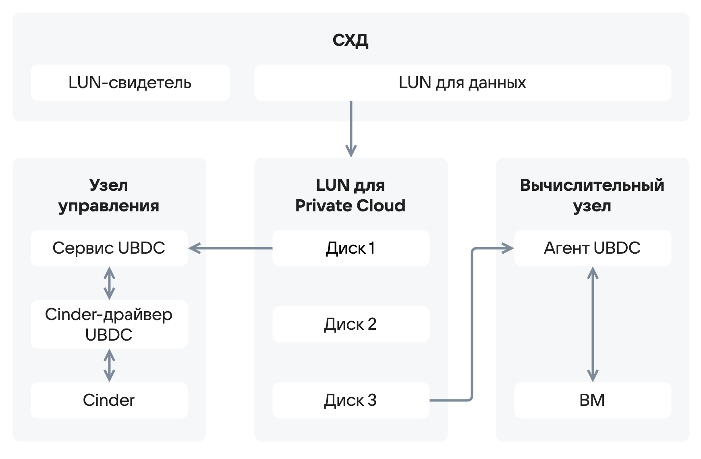
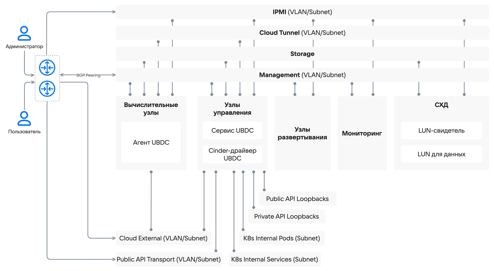

# {heading(Универсальное подключение СХД)[id=design_connecting_storage]}

Universal Block Device Connector (UBDC) — решение для подключения к {var(sys3)} сторонних блочных устройств с СХД по поддерживаемым в РЕД ОС протоколам (iSCSI, FC и другим).

UBDC реализован компонентом NVMeBox.

## {heading(Описание)[id=design_ubdc_description]}

UBDC поддерживает широкий спектр СХД. Служба-коннектор запускается на каждом вычислительном узле и узлах слоя управления, на которых расположены инстансы Cinder. Для нужд {var(sys2)} на СХД выделяется два LUN:

* LUN-свидетель. Хранит копию конфигурации кластера, поддерживает его работоспособность. Помогает собрать кворум голосов в случае сбоя одного из узлов.
* LUN для данных. LUN разбивается на партиции, каждая из которых монтируется как виртуальный диск. Диск подключается к конкретной ВМ при использовании или к службам Cinder при осуществлении операций без подключения к ВМ. 

LUN подключены ко всем инстансам службы-коннектора. Для работы UBDC не требуется доступа к управлению СХД, только доступ к выделенному LUN. Архитектура решения приведена на {linkto(#pic_ubdc_solution_architecture)[text=рисунке %number]}.

{caption(Рисунок {counter(pic)[id=numb_pic_ubdc_solution_architecture]} — Архитектура решения)[align=center;position=under;id=pic_ubdc_solution_architecture;number={const(numb_pic_ubdc_solution_architecture)}]}
{params[width=70%; printWidth=70%; noBorder=true]}
{/caption}

Обращение к СХД происходит через выделенную для работы с хранилищами сеть Storage или Ceph External. Возможно разделение сетей для работы с СХД и Ceph, в том числе использование сетей FC/FCoE. Рекомендуется выносить сети хранилища на отдельные сетевые адаптеры с пропускной способностью 25 Гбит/с (для сетей FC — 32 Гбит/с) и более. Схема архитектуры сети приведена на {linkto(#pic_ubdc_ethernet)[text=рисунке %number]}.

{caption(Рисунок {counter(pic)[id=numb_pic_ubdc_ethernet]} — Сетевая схема решения)[align=center;position=under;id=pic_ubdc_ethernet;number={const(numb_pic_ubdc_ethernet)}]}
{params[noBorder=true]}
{/caption}

## {heading(Применение)[id=design_ubdc_use]}

UBDC является высокопроизводительным и надежным решением. Оно рекомендуется для использования как вместо, так и в дополнение к SDS Ceph.

При использовании UBDC рекомендуется соблюдать следующие правила:

* СХД должна иметь в своем составе как минимум два контроллера, которые будут указаны в качестве точек подключения в настройках коннектора. Это позволит защитить систему от выхода из строя одного из контроллеров или его сетевых интерфейсов.
* Для отказоустойчивости сетевых подключений использовать динамическую маршрутизацию (L3) вместо агрегированного подключения LACP (L2). Это требуется из-за ограничений протокола iSCSI.
* Расчет пропускной способности сети подключения к СХД выполнять в зависимости от требований к производительности и с учетом возможностей производительности хранилища. При необходимости выносить подключение на выделенные сетевые адаптеры и увеличивать их количество.

## {heading(Ограничения)[id=design_ubdc_limitation]}
     
* Не рекомендуется совмещать на одном наборе адаптеров сети доступа к СХД и сети управления {var(sys2)}, а также транспортные сети оверлейных сетей и внешние сети.
* Используемые для работы {var(sys2)} LUN не могут быть одновременно использованы ни в каких других целях. Это может привести к потере данных и нестабильной работе как {var(sys2)}, так и другого использующего данный LUN ПО.

<!--- В платформе не реализован режим Metrocluster. Решено не писать про Metrocluster, пока не будет реализовано

* {var(sys1)} не поддерживает режим Metrocluster. К дискам на LUN, созданном в этом режиме, будет применена зона доступности, указанная для данного типа диска. При миграции диска в другую зону доступности будет выполнено полное копирование данных даже если в указанной зоне уже есть реплика диска, созданная в режиме Metrocluster.
--->