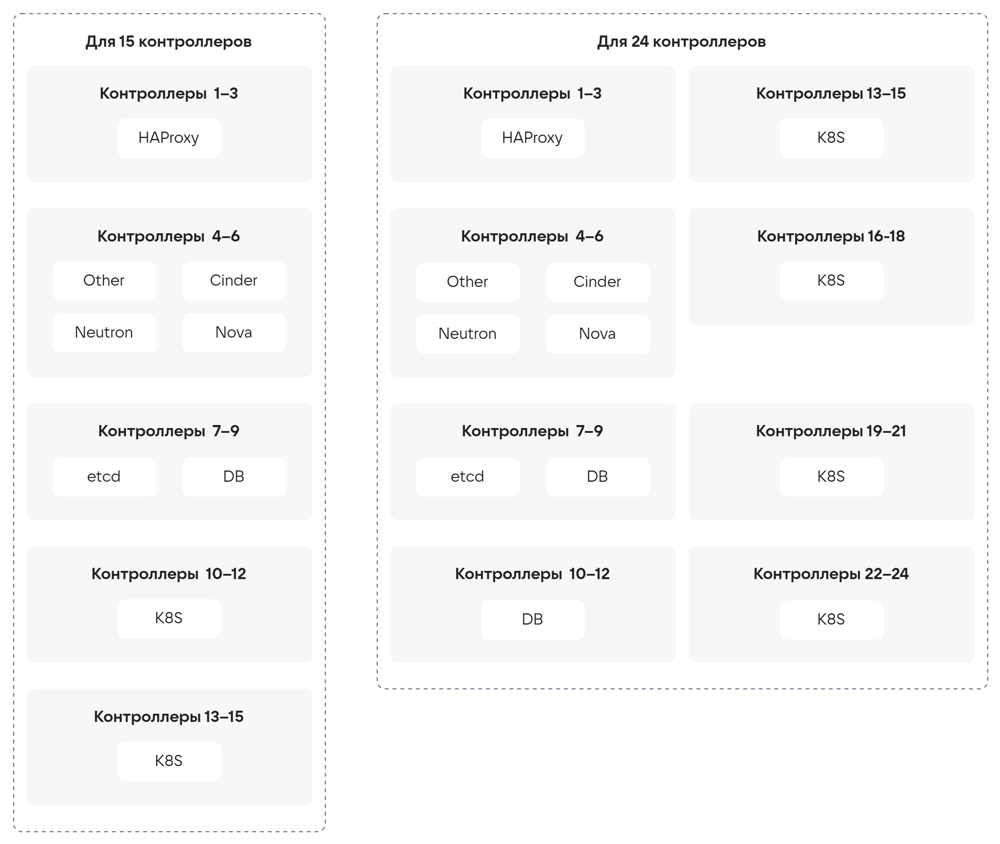

# {heading(Расчеты серверов контура управления)[id=design_control_loop_server_calculations]}

## {heading(Контроллеры (узлы управления))[id=calculations_controllers]}

Серверы управления управляют следующими службами {var(sys2)}:

* Базы данных компонентов.
* Очереди сообщений.
* Идентификация, аутентификация и авторизация пользователей.
* Портал самообслуживания и Портал администратора.
* API компонентов.

Для расчета мощностей оборудования серверов управления необходимы следующие входные данные:

* Как много экземпляров пользовательской нагрузки будет запущено.
* Сколькими ВУ будут управлять контроллеры.
* Сколько пользователей будет работать с Порталами и API одновременно.
* Какое количество экземпляров нагрузки будет пересоздаваться в небольшие временные интервалы.
* Какой максимальный размер образа ВМ будет использоваться.
* Какие требования к передаче образов ВМ с приемлемой скоростью.
* Прогнозируемый рост мощностей облака в течение года, в течение трех лет.

{var(sys1)} разработана таким образом, что поддерживает горизонтальное масштабирование серверов управления. В связи с необходимостью обеспечения кворума кластерных сервисов количество контроллеров должно быть кратно трем, за исключением worker-узлов служебного кластера Kubernetes — их количество может быть произвольным.

Для обеспечения отказоустойчивости слоя управления допускается размещение серверов в трех доменах отказа.

Базовая конфигурация контроллера приведена в {linkto(#tab_basic_controller_configuration)[text=таблице %number]}.

{caption(Таблица {counter(table)[id=numb_tab_basic_controller_configuration]} — Базовая конфигурация контроллера)[align=right;position=above;id=tab_basic_controller_configuration;number={const(numb_tab_basic_controller_configuration)}]}
[cols="1,3", options="header"]
|===
|Параметр
|Минимальные требования

|Процессор
|2x Intel Xeon Gold (минимум 28 ядер)

|Оперативная память
|512 ГБ

|Хранилище
|2x 480 ГБ SSD — для ОС.

2x 3,84 ТБ NVMe — для контроллеров под размещение служебных БД компонентов

|Сеть
|4x 25 Гбит/с (2x LACP).

4x 10 Гбит/с (2x LACP).

Выделенный интерфейс управления (IPMI, BMC, iDRAC, iLO и т.п.)
|===
{/caption}

Чтобы определить требуемое количество контроллеров, в первую очередь необходимо определить профиль нагрузки, планируемый для будущей инсталляции. Расчет для каждого профиля нагрузки приведен в {linkto(#tab_lastprofil)[text=таблице %number]}.

{caption(Таблица {counter(table)[id=numb_tab_lastprofil]} — Определяемые профили нагрузки)[align=right;position=above;id=tab_lastprofil;number={const(numb_tab_lastprofil)}]}
[cols="3,1,1,1", options="header"]
|===
|
|Публичное облако
|Динамическая среда
|Статическая среда

|Количество проектов на вычислительный узел
|более 5
|более 2
|до 1

|Количество ВМ на вычислительный узел
|более 40
|более 20
|до 10

|Среднее время жизни ВМ
|менее 3 дней
|менее 7 дней
|более 30 дней

|Соотношение инстансов PaaS и обычных ВМ
|50/50
|70/30
|90/10
|===
{/caption}

Профиль нагрузки зависит от сочетания типов нагрузки в {var(sys2)}. При наличии в инсталляции нескольких типов нагрузки доступны промежуточные профили (80/20, 50/50, 20/80), которые отражают планируемое соотношение типов нагрузки или их промежуточную интенсивность.

<err>

Допускается погрешность на один шаг профиля нагрузки в большую или меньшую сторону (кроме профиля **Публичное облако**). При недостаточном масштабе Control Plane возможны проблемы с производительностью при высокой нагрузке запросами на изменение, но не отказы в обслуживании.

</err>

<info>

В дальнейшем планируется перерасчет данных в {linkto(#tab_lastprofil)[text=таблице %number]} с учетом частоты изменений разных типов сущностей, а также увеличение детализации масштабирования Control Plane.

</info>

По профилю нагрузки следует определить требуемое процентное соотношение узлов управления и рабочей нагрузки ({linkto(#tab_control_plane_percent)[text=таблица %number]}).

{caption(Таблица {counter(table)[id=numb_tab_control_plane_percent]} — Процент выделения узлов управления в зависимости от профиля нагрузки)[align=right;position=above;id=tab_control_plane_percent;number={const(numb_tab_control_plane_percent)}]}
[cols="1,1,1,1,1,1,1", options="header"]
|===
|Количество вычислительных узлов
|Публичное облако
|Динамическая среда
|Повышенная нагрузка (80/20)
|Средняя нагрузка (50/50)
|Легкая нагрузка (20/80)
|Статическая среда

|более 300
|15 %
|10 %
|8 %
|6 %
|3 %
|2 %

|30-300
|15 %
|10 %
|10 %
|8 %
|6 %
|4 %
|===
{/caption}

На основе данных из {linkto(#tab_control_plane_percent)[text=таблицы %number]} возможно масштабирование количества узлов управления для разных вариантов профиля нагрузки и разного количества вычислительных узлов. Варианты масштабирования приведены в {linkto(#tab_control_plane_scaling)[text=таблице %number]}.

{caption(Таблица {counter(table)[id=numb_tab_control_plane_scaling]} — Пример масштабирования узлов управления в зависимости от нагрузки и количества вычислительных узлов)[align=right;position=above;id=tab_control_plane_scaling;number={const(numb_tab_control_plane_scaling)}]}
[cols="3,2,2,2,2,2,2", options="header"]
|===
|Количество вычислительных узлов
|Публичное облако
|Динамическая среда
|Повышенная нагрузка (80/20)
|Средняя нагрузка (50/50)
|Легкая нагрузка (20/80)
|Статическая среда

|100
|15
|9
|9
|9
|6
|3

|200
|30
|21
|21
|15
|12
|9

|300
|45
|30
|30
|24
|18
|12

|400
|60
|39
|33
|24
|12
|9

|500
|75
|51
|39
|30
|15
|9

|600
|90
|60
|48
|36
|18
|12

|700
|105
|69
|57
|42
|21
|15

|800
|120
|81
|63
|48
|24
|15

|900
|135
|90
|72
|54
|27
|18

|1000
|150
|99
|81
|60
|30
|21

|1100
|165
|111
|87
|66
|33
|21

|1200
|180
|120
|96
|72
|36
|24

|1300
|195
|129
|105
|78
|39
|27

|1400
|210
|141
|111
|84
|42
|27

|1500
|225
|150
|120
|90
|45
|30

|1600
|240
|159
|129
|96
|48
|33

|1700
|255
|171
|135
|102
|51
|33

|1800
|270
|180
|144
|108
|54
|36

|1900
|285
|189
|153
|114
|57
|39

|2000
|300
|201
|159
|120
|60
|39
|===
{/caption}

## {heading(Узлы мониторинга и логирования)[id=calculations_monitoring_and_logging_nodes]}

Нагрузка на узлы мониторинга и логирования варьируется от количества вычислительных узлов и состава {var(sys2)}. Если в состав {var(sys2)} включается Cloud Storage от VK или количество вычислительных узлов превышает 100, рекомендуется закладывать минимум 3 узла. В остальных случаях допустимо ограничиться одним узлом. Базовая конфигурация узла мониторинга и логирования приведена в {linkto(#tab_basic_configuration_of_monitoring_and_logging_node)[text=таблице %number]}.

{caption(Таблица {counter(table)[id=numb_tab_basic_configuration_of_monitoring_and_logging_node]} — Базовая конфигурация узла мониторинга и логирования)[align=right;position=above;id=tab_basic_configuration_of_monitoring_and_logging_node;number={const(numb_tab_basic_configuration_of_monitoring_and_logging_node)}]}
[cols="1,3", options="header"]
|===
|Параметр
|Минимальные требования

|Процессор
|2x Intel Xeon Silver 4210R (16 ядер)

|Оперативная память
|128 ГБ

|Хранилище
|2x 480 ГБ SSD — для ОС.

2x 3,84 ТБ NVMe — под размещение БД компонентов

|Сеть
|2x 10 Гбит/с (LACP).

Выделенный интерфейс управления (IPMI, BMC, iDRAC, iLO и т.п.)
|===
{/caption}

## {heading(Узел развертывания/репозитория)[id=calculations_deployment_repository_node]}

Роль узла развертывания/репозитория не предъявляет высоких требований к оборудованию и не нуждается в специальных расчетах. Базовая конфигурация приведена в {linkto(#tab_basic_deployment_node_repository_configuration)[text=таблице %number]}.

{caption(Таблица {counter(table)[id=numb_tab_basic_deployment_node_repository_configuration]} — Базовая конфигурация узла развертывания/репозитория)[align=right;position=above;id=tab_basic_deployment_node_repository_configuration;number={const(numb_tab_basic_deployment_node_repository_configuration)}]}
[cols="1,3", options="header"]
|===
|Параметр
|Минимальные требования

|Процессор
|2x Intel Xeon (8 ядер)

|Оперативная память
|16 ГБ

|Хранилище
|2x 960 ГБ SSD

|Сеть
|1x 10 Гбит/с (LACP).

Выделенный интерфейс управления (IPMI, BMC, iDRAC, iLO и т.п.)
|===
{/caption}

## {heading(Принципы масштабирования контроллеров)[id=calculations_controller_scaling_principles]}

При увеличении размеров инсталляции потребуется увеличение количества контроллеров, при этом сами контроллеры будут приобретать специализацию.

Компонентами управляющего слоя, которым требуются проектирование раскладки по серверам, являются следующие крупные блоки:

* HAProxy — компонент балансировки управляющего трафика:

   * Разделяется на два типа: Public и Private.
   * Использует Loopback для приема трафика.
   * Требуется не более трех серверов на всю инсталляцию для каждой суброли (Private/Public).

* Database — кластеры служебных баз данных:

   * Минимальная стартовая конфигурация — 3 сервера.
   * Для каждого сервиса используется свой кластер.
   * При масштабировании допускается добавлять либо один сервер с переносом части реплик БД, либо три сервера с переносом на него всех реплик одной или нескольких БД.
   * Требуется установка дисков с низкой задержкой записи и чтения. Пример: NVMe.

* etcd — высоконадежное распределенное хранилище для пар «ключ-значение»:

   * Минимальная стартовая конфигурация — 3 сервера.
   * Для каждого сервиса используется свой кластер.
   * При масштабировании добавляется 1 сервер с переносом на него одной реплики.
   * Требуется установка дисков с низкой задержкой записи и чтения (в идеале NVMe).
   * Может быть совмещен с DB, если позволяют ресурсы.

* Служебный Kubernetes (K8S) для части управляющего ПО VK {var(system)}:

   * Состоит из Master- и Worker-узлов.
   * Для отказоустойчивой схемы функционирования Master-узлов необходимо и достаточно трех серверов.
   * Масштабирование Worker-узлов выполняется по формуле `n` + `1`.

* Cinder — сервис блочного хранения данных:

   * Может быть совмещен с Nova и Neutron.

* Nova — сервис вычислительной инфраструктуры:

   * Может быть совмещен с Cinder и Neutron.

* Neutron — сервис сетевой инфраструктуры VK {var(system)}:

   * Высокое потребление вычислительных ресурсов (CPU).
   * Может быть совмещен с Cinder и Nova.

* Other — прочее ПО, необходимое для работы {var(sys2)}.

При добавлении новых контроллеров на новые узлы будут выноситься следующие компоненты (в порядке очередности):

* Служебный Kubernetes.
* Служебные базы данных и etcd.
* HAProxy.

Варианты раскладки компонентов по контроллерам для различного количества контроллеров приведены на {linkto(#pic_design_control_loop_server_1)[text=рисунке %number]} и {linkto(#pic_design_control_loop_server_2)[text=рисунке %number]}.

{caption(Рисунок {counter(pic)[id=numb_pic_design_control_loop_server_1]} — Варианты раскладки компонентов по 3, 6, 9 и 12 контроллерам)[align=center;position=under;id=pic_design_control_loop_server_1;number={const(numb_pic_design_control_loop_server_1)}]}
{params[noBorder=true]}
{/caption}

{caption(Рисунок {counter(pic)[id=numb_pic_design_control_loop_server_2]} — Варианты раскладки компонентов по 15 и 24 контроллерам)[align=center;position=under;id=pic_design_control_loop_server_2;number={const(numb_pic_design_control_loop_server_2)}]}
{params[width=75%; printWidth=85%; noBorder=true]}
{/caption}

## {heading(Принципы масштабирования распределенного управляющего слоя и сетевых узлов)[id=distributed_control_network_scaling_principles]}

В случае распределенного слоя управления необходимо размещать контроллеры в трех доменах отказа. Пример раскладки компонентов по контроллерам и доменам отказа (для количества контроллеров 3 и 6) приведен на {linkto(#pic_design_control_loop_server_3_6)[text=рисунке %number]}.

{caption(Рисунок {counter(pic)[id=numb_pic_design_control_loop_server_3_6]} — Пример раскладки компонентов по контроллерам и доменам отказа (для количества контроллеров 3 и 6))[align=center;position=under;id=pic_design_control_loop_server_3_6;number={const(numb_pic_design_control_loop_server_3_6)}]}
{params[width=90%; printWidth=95%; noBorder=true]}
{/caption}

Сетевые узлы масштабируются по количеству проектных сетей в каждой зоне доступности. Количество сетевых узлов рассчитывается для каждой зоны доступности (подробнее — в разделе {linkto(../../design_principles_main/design_workload_server_calculations#calculation_number_network_nodes)[text=%text]}).