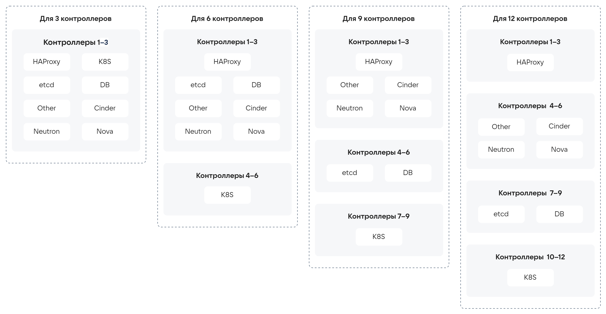

# {heading(Расчёты серверов контура управления)[id=design_control_loop_server_calculations]}

## {heading(Контроллеры)[id=calculations_controllers]}

Серверы управления управляют следующими службами {var(sys2)}:

* Базы данных компонентов.
* Очереди сообщений.
* Идентификация, аутентификация и авторизация пользователей.
* Портал самообслуживания и Портал администратора.
* API компонентов.

Для расчёта мощностей оборудования серверов управления необходимы следующие входные данные:

* Как много экземпляров пользовательской нагрузки будет запущено.
* Сколькими ВУ будут управлять контроллеры.
* Сколько пользователей будет работать с Порталами и API одновременно.
* Какое количество экземпляров нагрузки будет пересоздаваться в небольшие временные интервалы.
* Какой максимальный размер образа ВМ будет использоваться.
* Какие требования к передаче образов ВМ с приемлемой скоростью.
* Прогнозируемый рост мощностей облака в течение года, в течение трёх лет.

{var(sys1)} разработана таким образом, что поддерживает горизонтальное масштабирование серверов управления. В связи с необходимостью обеспечения кворума кластерных сервисов количество контроллеров должно быть кратно трём. Количество контроллеров должно составлять 10–15% от суммарного количества вычислительных узлов.

Для обеспечения отказоустойчивости слоя управления допускается размещение серверов в трёх доменах отказа (подробнее — в разделе {linkto(../../design_principles_main/design_separation_methods#distributed_control_layer_and_fault_tolerance)[text=%text]}).

Базовая конфигурация контроллера приведена в {linkto(#tab_basic_controller_configuration)[text=таблице %number]}.

{caption(Таблица {counter(table)[id=numb_tab_basic_controller_configuration]} — Базовая конфигурация контроллера)[align=right;position=above;id=tab_basic_controller_configuration;number={const(numb_tab_basic_controller_configuration)}]}
[cols="1,3", options="header"]
|===
|Параметр
|Минимальные требования

|Процессор
|2x Intel Xeon Gold (минимум 28 ядер)

|Оперативная память
|512 ГБ

|Хранилище
|2x 480 ГБ SSD — для ОС

2x 3,84 ТБ NVMe — для контроллеров под размещение служебных БД компонентов

|Сеть
|4x 25 Гбит/с (2x LACP)

4x 10 Гбит/с (2x LACP)

Выделенный интерфейс управления (IPMI, BMC, iDRAC, iLO и т.п.)
|===
{/caption}

## {heading(Узлы мониторинга и логирования)[id=calculations_monitoring_and_logging_nodes]}

Нагрузка на узлы мониторинга и логирования варьируется от количества вычислительных узлов и состава {var(sys2)}. Если в состав {var(sys2)} включается Cloud Storage от VK или количество вычислительных узлов превышает 100, рекомендуется закладывать минимум 3 узла. В остальных случаях допустимо ограничиться одним узлом. Базовая конфигурация узла мониторинга и логирования приведена в {linkto(#tab_basic_configuration_of_monitoring_and_logging_node)[text=таблице %number]}.

{caption(Таблица {counter(table)[id=numb_tab_basic_configuration_of_monitoring_and_logging_node]} — Базовая конфигурация узла мониторинга и логирования)[align=right;position=above;id=tab_basic_configuration_of_monitoring_and_logging_node;number={const(numb_tab_basic_configuration_of_monitoring_and_logging_node)}]}
[cols="1,3", options="header"]
|===
|Параметр
|Минимальные требования

|Процессор
|2x Intel Xeon Silver 4210R (16 ядер)

|Оперативная память
|128 ГБ

|Хранилище
|2x 480 ГБ SSD — для ОС

2x 3,84 ТБ NVMe — под размещение БД компонентов

|Сеть
|2x 10 Гбит/с (LACP)

Выделенный интерфейс управления (IPMI, BMC, iDRAC, iLO и т.п.)
|===
{/caption}

## {heading(Узел развёртывания/репозитория)[id=calculations_deployment_repository_node]}

Роль узла развёртывания/репозитория не предъявляет высоких требований к оборудованию и не нуждается в специальных расчётах. Базовая конфигурация приведена в {linkto(#tab_basic_deployment_node_repository_configuration)[text=таблице %number]}.

{caption(Таблица {counter(table)[id=numb_tab_basic_deployment_node_repository_configuration]} — Базовая конфигурация узла развёртывания/репозитория)[align=right;position=above;id=tab_basic_deployment_node_repository_configuration;number={const(numb_tab_basic_deployment_node_repository_configuration)}]}
[cols="1,3", options="header"]
|===
|Параметр
|Минимальные требования

|Процессор
|2x Intel Xeon (8 ядер)

|Оперативная память
|16 ГБ

|Хранилище
|2x 960 ГБ SSD

|Сеть
|1x 10 Гбит/с (LACP)

Выделенный интерфейс управления (IPMI, BMC, iDRAC, iLO и т.п.)
|===
{/caption}

## {heading(Принципы масштабирования контроллеров)[id=calculations_controller_scaling_principles]}

При увеличении размеров инсталляции потребуется увеличение количества контроллеров, при этом сами контроллеры будут приобретать специализацию.

Компонентами управляющего слоя, которым требуются проектирование раскладки по серверам, являются следующие крупные блоки:

* HAProxy — компонент балансировки управляющего трафика:

   * Разделяется на два типа: Public и Private.
   * Использует Loopback для приёма трафика.
   * Требуется не более трёх серверов на всю инсталляцию для каждой суброли (Private/Public).

* Database — кластеры служебных баз данных:

   * Минимальная стартовая конфигурация — 3 сервера.
   * Для каждого сервиса используется свой кластер.
   * При масштабировании допускается добавлять либо один сервер с переносом части реплик БД, либо три сервера с переносом на него всех реплик одной или нескольких БД.
   * Требуется установка дисков с низкой задержкой записи и чтения (например, NVMe).

* etcd — высоконадёжное распределённое хранилище для пар «ключ-значение»:

   * Минимальная стартовая конфигурация — 3 сервера.
   * Для каждого сервиса используется свой кластер.
   * При масштабировании добавляется 1 сервер с переносом на него одной реплики.
   * Требуется установка дисков с низкой задержкой записи и чтения (в идеале NVMe).
   * Может быть совмещён с DB, если позволяют ресурсы.

* Служебный Kubernetes (K8S) для части управляющего ПО VK {var(system)}:

   * Состоит из Master- и Worker-узлов.
   * Для отказоустойчивой схемы функционирования Master-узлов необходимо и достаточно трёх серверов.
   * Масштабирование Worker-узлов выполняется по схеме `n+1`.

* Cinder — сервис блочного хранения данных:

   * Может быть совмещен с Nova и Neutron.

* Nova — сервис вычислительной инфраструктуры:

   * Может быть совмещен с Cinder и Neutron.

* Neutron — сервис сетевой инфраструктуры VK {var(system)}:

   * Высокое потребление вычислительных ресурсов (CPU).
   * Может быть совмещен с Cinder и Nova.

* Other — прочее ПО, необходимое для работы {var(sys2)}.

При добавлении новых контроллеров на новые узлы будут выноситься следующие компоненты (в порядке очерёдности):

* Служебный Kubernetes.
* Служебные базы данных и etcd.
* HAProxy.

Варианты раскладки компонентов по контроллерам для различного количества контроллеров приведены на {linkto(#pic_design_control_loop_server_1)[text=рисунке %number]} и {linkto(#pic_design_control_loop_server_2)[text=рисунке %number]}.

{caption(Рисунок {counter(pic)[id=numb_pic_design_control_loop_server_1]} — Варианты раскладки компонентов по 3, 6, 9 и 12 контроллерам)[align=center;position=under;id=pic_design_control_loop_server_1;number={const(numb_pic_design_control_loop_server_1)}]}
{params[noBorder=true]}
{/caption}

{caption(Рисунок {counter(pic)[id=numb_pic_design_control_loop_server_2]} — Варианты раскладки компонентов по 15 и 24 контроллерам)[align=center;position=under;id=pic_design_control_loop_server_2;number={const(numb_pic_design_control_loop_server_2)}]}
{params[width=75%; printWidth=85%; noBorder=true]}
{/caption}

## {heading(Принципы масштабирования распределённого управляющего слоя и сетевых узлов)[id=NEED_ID_HEADING]}

В случае распределённого слоя управления необходимо размещать контроллеры в трёх доменах отказа (подробнее — в разделе {linkto(../../design_principles_main/design_separation_methods#distributed_control_layer_and_fault_tolerance)[text=%text]}). Пример раскладки компонентов по контроллерам и доменам отказа (для количества контроллеров 3 и 6) приведён на {linkto(#pic_design_control_loop_server_3_6)[text=рисунке %number]}.

{caption(Рисунок {counter(pic)[id=numb_pic_design_control_loop_server_3_6]} — Пример раскладки компонентов по контроллерам и доменам отказа (для количества контроллеров 3 и 6))[align=center;position=under;id=pic_design_control_loop_server_3_6;number={const(numb_pic_design_control_loop_server_3_6)}]}
{params[width=90%; printWidth=95%; noBorder=true]}
{/caption}

Сетевые узлы масштабируются по количеству проектных сетей в каждой зоне доступности. Количество сетевых узлов рассчитывается для каждой зоны доступности (подробнее — в разделе {linkto(../../design_principles_main/design_workload_server_calculations#calculation_number_network_nodes)[text=%text]}).