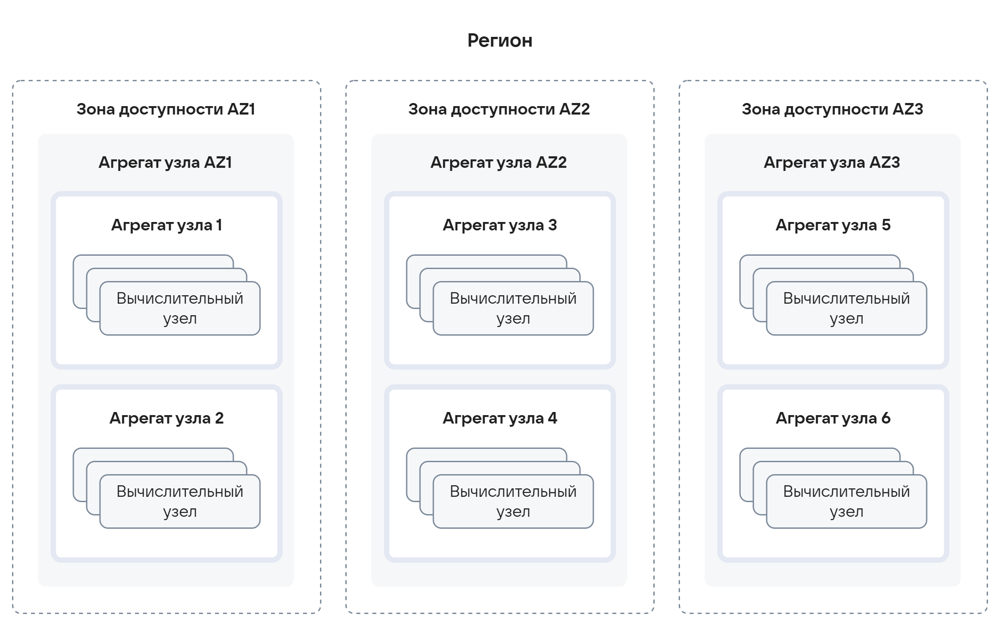
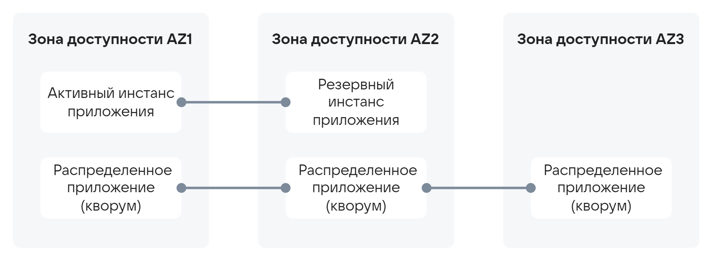
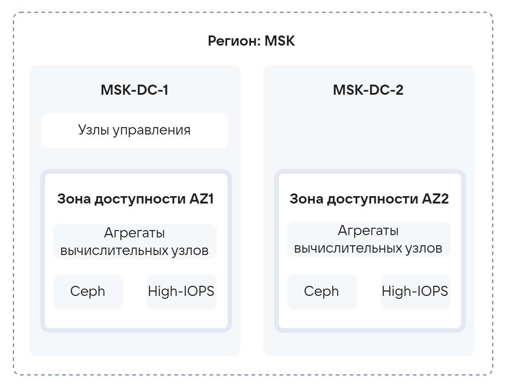
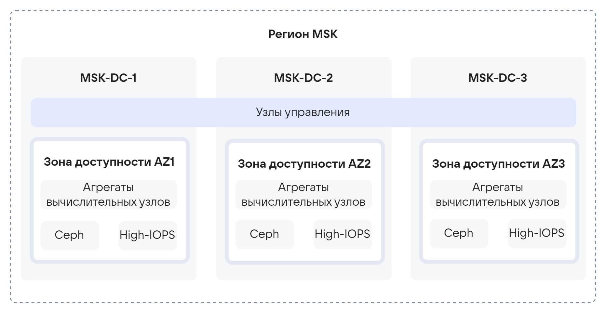

# {heading(Методы разделения {var(system)})[id=design_separation_methods]}

Разделение {var(sys2)} — комплекс мер, позволяющих сегментировать ресурсы облака для эффективного распределения рабочих нагрузок в облаке. С помощью разделения облака решаются следующие задачи:

* Обеспечение прав на персональные данные.
* Физическая изоляция сегментов и избыточность по отношению к другим сегментам.
* Управление группами оборудования с различающимися характеристиками.

{var(sys1)} поддерживает следующие методы разделения:

1. Регион.
1. Зона доступности.
1. Агрегаты вычислительных узлов.

Любая инсталляция {var(sys2)} включает в себя регион. Регион включает в себя одну или несколько зон доступности. Зона доступности включает в себя один или несколько агрегатов вычислительных узлов ({linkto(#pic_design_separation_method_zone_region)[text=рисунок %number]}).

{caption(Рисунок {counter(pic)[id=numb_pic_design_separation_method_zone_region]} — Методы разделения {var(sys2)})[align=center;position=under;id=pic_design_separation_method_zone_region;number={const(numb_pic_design_separation_method_zone_region)}]}
{params[width=80%; printWidth=90%; noBorder=true]}
{/caption}

В {linkto(#tab_comparison_of_separation_methods)[text=таблице %number]} приведён сравнительный анализ каждого метода разделения.

{caption(Таблица {counter(table)[id=numb_tab_comparison_of_separation_methods]} — Сравнительный анализ методов разделения)[align=right;position=above;id=tab_comparison_of_separation_methods;number={const(numb_tab_comparison_of_separation_methods)}]}
[cols="1,2,2,2", options="header"]
|===
|Методы разделения
|Необходимость использования
|Пример
|Накладные расходы

|Регион
|Одиночные инсталляции без необходимости координации между собой
|Облако с множеством точек присутствия (площадок), в котором создание рабочих нагрузок производится на определённой площадке и требуется общая инфраструктура
|Собственные серверы управляющего слоя для каждого сайта

|Зона доступности
|Логическое разделение инсталляции для физического разделения и отказоустойчивости
|Отдельная инсталляция с оборудованием, размещённом в нескольких ЦОД
|Изменение настроек при подготовке к инсталляции

|Агрегат вычислительных узлов
|Управление группой ВУ с общими характеристиками оборудования
|Планирование ВУ с различной конфигурацией оборудования
|Изменение настроек администратором по завершении инсталляции
|===
{/caption}

Описание разделения инсталляции описывается в разделе 1 (Сведения о проекте) документа **Требования к инфраструктуре**.

<warn>

Необходимо указывать два значения описания для каждой сущности:

* Название — как будет обозначаться сущность в GUI.
* Имя — как будет обозначаться сущность в API/Inventory.

</warn>

## {heading(Регионы)[id=methods_regions]}

Регион — это отдельная инсталляция, развёртываемая независимо от других инсталляций. Регионы имеют собственные наборы API и порталов для работы пользователей и администраторов, однако могут иметь общие точки интеграции для управления проектами и доступа к ним из различных регионов. Пользователь должен явно указать, в каком именно регионе необходимо создать его рабочую нагрузку. Каждый регион имеет свой набор образов, проектов и несвязанных между регионами сетей.

Регионы располагаются на площадках с большим географическим удалением. Таким образом, можно обеспечить наличие инсталляции в различных точках присутствия при одновременном отсутствии достаточной пропускной способности сети между площадками.

Изолированность программных компонентов {var(sys2)} между регионами позволяет локализовать базы данных пользователей {var(sys2)} и приложений, размещаемых в {var(sys3)} (локализация хранения персональных данных).

Регионы связываются между собой единой опорной сетью. Минимальная пропускная способность сети — 10 Мбит/с.

В текущей версии {var(sys2)} поддержка множества регионов носит базовый характер, общими являются интеграции с внешними сервисами (AD/LDAP, NTP, DNS и т.д.). При этом из соображений отказоустойчивости требуется иметь в каждом домене отказа каждого региона свою конечную точку интеграции (локальный сервер общей структуры интегрируемых сервисов).

<warn>

Рекомендуется обеспечить связность сетей Management между всеми регионами.

</warn>

## {heading(Зоны доступности)[id=methods_availability_zones]}

Зоны доступности — метод разделения ресурсов {var(sys2)}, расположенных в пределах региона в целях физического разделения инсталляции и выполнения требований отказоустойчивости.

<warn>

В любой инсталляции {var(sys2)} существует как минимум одна зона доступности.

</warn>

Зоны доступности должны быть связаны между собой высокоскоростными каналами связи с низким уровнем задержек. По сравнению с требованиями к каналам связи между регионами минимальные требования связи между зонами доступности более высокие — не менее 40 Гбит/с при задержках не более 5 мс.

Зона доступности содержит свои вычислительные узлы, блочные хранилища и сетевое оборудование. С зонами доступности связаны следующие виды рабочих нагрузок:

* Виртуальные машины.
* Виртуальные диски.
* Балансировщики нагрузки.
* Файловые хранилища.
* Экземпляры СУБД.
* Master-узлы и группы узлов кластеров Kubernetes.

Штатное функционирование зоны доступности зависит от следующих служб:

* Образы ВМ.
* Блочные хранилища.
* Сеть.
* Внешние объектные хранилища.

Выход из строя зоны доступности — это любые события, приводящие к деградации способности зоны доступности держать рабочую нагрузку.

При планировании зон доступности необходимо руководствоваться следующими ограничениями:

* Пользователи не будут знать о наличии или отсутствии свободных ресурсов в зоне доступности. При этом при создании рабочей нагрузки пользователю необходимо будет явно указывать зону доступности.
* Зоны доступности призваны разделять оборудование контура рабочих нагрузок по доменам отказа.
* Зоны доступности не следует использовать для сегментации узлов рабочих нагрузок по типам используемого оборудования (подробнее — в разделе {linkto(../../design_principles_main/design_separation_methods#aggregates_of_computing_nodes)[text=%text]}).
* Зоны доступности не предназначены для организации разных типов рабочего окружения (например: `dev`, `stage` и `production`).

Для проектирования {var(sys2)} зона доступности определяется как единичный домен отказа, предназначенный для разделения узлов рабочих нагрузок в целях защиты от различных негативных сценариев: отказ электропитания, отказ сети и т.д. Домен отказа — набор аппаратных компонентов, совместно использующих единую точку отказа.

Существуют четыре классических домена отказа:

* ЦОД.
* Машинный зал.
* Ряд стоек.
* Стойка.

Типовые единые точки отказа приведены в {linkto(#tab_typical_failure_point_units)[text=таблице %number]}.

{caption(Таблица {counter(table)[id=numb_tab_typical_failure_point_units]} — Типовые единицы точек отказа)[align=right;position=above;id=tab_typical_failure_point_units;number={const(numb_tab_typical_failure_point_units)}]}
[cols="1,3", options="header"]
|===
|Домен отказа
|Варианты единых точек отказа

|ЦОД
|Каналы связи между ЦОД, электропитание и охлаждение, форс-мажорные обстоятельства

|Машинный зал
|
**Электропитание**: возможен выход из строя всего машинного зала при превышении расчётной нагрузки по всем вводам.

**Охлаждение**: возможно отключение машинного зала из-за перегрузки системы охлаждения

|Ряд стоек
|**Электропитание**: в ЦОД ряды стоек с оборудованием подключены к электропитанию минимум от двух независимых вводов. При этом в каждую стойку заходит два луча. Возможен выход из строя целого ряда стоек при превышении расчётной мощности по обоим лучам

|Стойка
|**ToR без резервирования**: единственный ToR в стойке, без резервирования будет являться единой точкой отказа для стойки
|===
{/caption}

Оптимальное количество зон доступности — 2 или 3, в зависимости от требований к отказоустойчивости приложений. В двух зонах доступности можно размещать приложения Master-Slave. В трёх зонах доступности можно разместить приложения, требующие кворума сервисов ({linkto(#pic_design_separation_method_zone_region_1_3)[text=рисунок %number]}).

{caption(Рисунок {counter(pic)[id=numb_pic_design_separation_method_zone_region_1_3]} — Размещение приложения, требующих кворума сервисов, в трёх зонах доступности)[align=center;position=under;id=pic_design_separation_method_zone_region_1_3;number={const(numb_pic_design_separation_method_zone_region_1_3)}]}
{params[width=80%; printWidth=80%; noBorder=true]}
{/caption}

<warn>

Отказоустойчивость приложений, размещаемых в облаке, находится в зоне ответственности архитекторов соответствующих приложений.

</warn>

Требования, предъявляемые наличием нескольких зон доступности:

* В каждой зоне доступности {var(sys1)} имеет свой набор сетей.
* Необходимо обеспечить связность сетей Management, Cloud Tunnel и Ceph External (Storage).
* Проектные сети выполняются растянутыми на весь набор зон доступности.
* Между сетями Management, Cloud Tunnel, Ceph External (Storage), разных зон доступности не должно быть МСЭ. МСЭ ограничивают производительность и резко повышают сетевые задержки. МСЭ допускаются только на стыке с корпоративной сетью.

Для каждой зоны доступности в документе **Требования к инфраструктуре** заполняются разделы: 1 (Сведения о проекте), 2 (Серверы), 3 (Конфигурация серверов), 4 (Разметка дисков), 6 (Портовой бюджет) и 8 (Сети).

## {heading(Агрегаты вычислительных узлов)[id=aggregates_of_computing_nodes]}

Агрегат вычислительных узлов (далее — агрегат) — логическое объединение вычислительных узлов внутри одной зоны доступности, выделенных по характеристикам оборудования (например: тип процессора, объём памяти, дополнительное оборудование). Агрегаты используются для повышения гибкости управления ресурсами, обеспечения особых потребностей приложений и обеспечения мер информационной безопасности.

<warn>

Каждая зона доступности содержит как минимум один агрегат, включающий в себя все вычислительные узлы в этой зоне доступности.

</warn>

В отличие от зон доступности механизм агрегатов недоступен конечному пользователю, размещение ВМ в определённом агрегате выполняется автоматически на основании метаданных, которые задаются администраторами в свойствах типа ВМ (flavor).

Основные причины применения агрегатов:

* Размещение приложений с особыми требованиями к ресурсам:

   * Высокочастотные процессоры.
   * Экземпляры с большим объёмом RAM.

* Управление переподпиской.
* Монопольное использование ВУ или набора ВУ проектами или ВМ.
* Сетевая изоляция на физическом уровне.
* Требования ИБ для чувствительных данных.

Один ВУ может принадлежать нескольким агрегатам (в отличие от зоны доступности, где один ВУ может принадлежать только одной зоне).

Ограничения для агрегатов ВУ:

* Агрегат существует только в одной зоне доступности.
* В случае исчерпания доступных вычислительных ресурсов в агрегате будет недоступно создание ВМ заданного типа, связанного только с этим агрегатом. Миграция ВМ при отказе ВУ также будет недоступна.

Агрегаты (за исключением агрегата для зоны доступности) не создаются автоматически в ходе инсталляции. Настройки агрегатов необходимо выполнять после инсталляции {var(sys2)} в ходе подготовки {var(sys2)} к эксплуатации.

В документе **Требования к инфраструктуре** требования к дополнительным агрегатам отображаются в разделах 2 (Серверы) и 3 (Конфигурации серверов) в виде дополнительной строки для серверов с ролью `Compute`.

## {heading(Распределённый управляющий слой и отказоустойчивость)[id=distributed_control_layer_and_fault_tolerance]}

Для управляющего слоя применяется понятие домен отказа. Управляющий слой является единой сущностью, обеспечивающей управление всеми зонами доступности {var(sys2)}. Составные части управляющего слоя могут располагаться в тех же доменах отказа, что и некоторые или все зоны доступности {var(sys2)}.

В базовом варианте, все управляющие узлы располагаются в одном домене отказа, что обеспечивает полноценное управление всеми зонами доступности {var(sys2)}. В случае сбоя или потери связности с доменом отказа, содержащим управляющие узлы, оставшиеся зоны доступности будут продолжать выполнять рабочую нагрузку без возможности внесения изменений. В случае, если {var(sys1)} использует коммутационную фабрику, сетевая доступность рабочей нагрузки сохранится, в противном случае, связность будет потеряна ({linkto(#pic_design_separation_method_region_msk)[text=рисунок %number]}).

{caption(Рисунок {counter(pic)[id=numb_pic_design_separation_method_region_msk]} — Расположение всех управляющих узлов в одном домене отказа)[align=center;position=under;id=pic_design_separation_method_region_msk;number={const(numb_pic_design_separation_method_region_msk)}]}
{params[width=55%; printWidth=65%; noBorder=true]}
{/caption}

Сохранение управления {var(sys5)} может быть достигнуто с помощью архитектуры с управляющим слоем, «растянутым» по трём доменам отказа. Такая архитектура подразумевает распределение управляющих сервисов {var(sys2)} по трём доменам отказа. В минимальном варианте на каждый домен отказа приходится по одному серверу слоя управления. {var(sys1)} в конфигурации с «растянутым» на три домена отказа управляющим слоем будет устойчива к выходу из строя одного домена отказа ({linkto(#pic_design_separation_method_region_msk_1_3)[text=рисунок %number]}).

{caption(Рисунок {counter(pic)[id=numb_pic_design_separation_method_region_msk_1_3]} — Архитектура с управляющим слоем, «растянутым» по трём доменам отказа)[align=center;position=under;id=pic_design_separation_method_region_msk_1_3;number={const(numb_pic_design_separation_method_region_msk_1_3)}]}
{params[width=65%; printWidth=75%; noBorder=true]}
{/caption}

Архитектура с «растянутым» более чем на три домена отказа слоем управления не тестировалась, но допустима при условии совместной проработки с {var(company)}. При правильном подходе к проектированию, это позволит {var(sys3)} быть устойчивой к выходу из строя менее половины доменов отказа.

При потере связности с остальной частью {var(sys2)}, площадка, содержащая домен отказа слоя управления и зону доступности, продолжит функционировать изолированно. Управление этой зоной доступности будет недоступно. Рабочая нагрузка продолжит выполняться и сохранит связность в пределах доступных сетевых сегментов.

С точки зрения экономии ресурсов, разумным является следующий подход: при наличии в {var(sys3)} произвольного числа зон доступности, слой управления растягивается лишь на три домена отказа. Этого достаточно для обеспечения защиты {var(sys2)} от выхода из строя любой одной площадки.