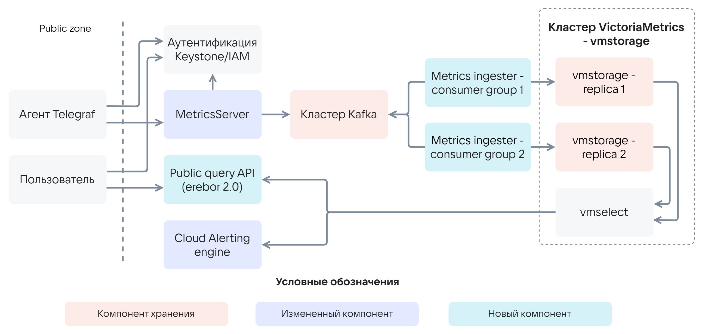
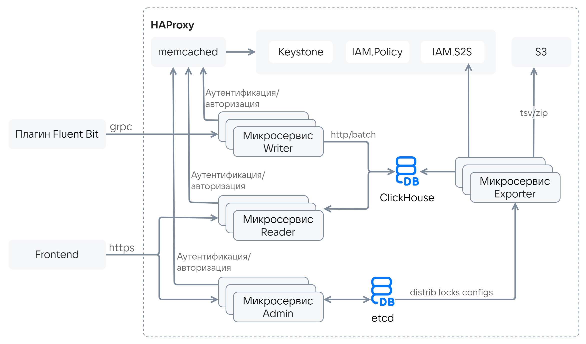
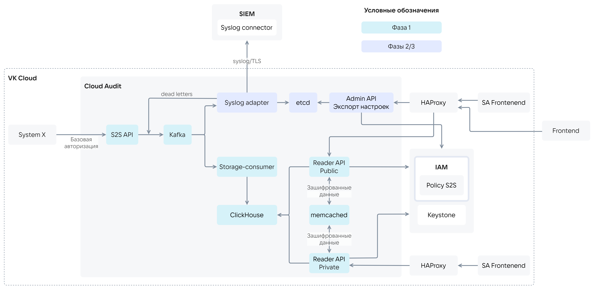

# {heading(Расчеты серверов слоя прикладных сервисов)[id=design_service_layer_server_calculations]}

<warn>

Расчет серверов основан на теоретических моделях и ограничениях программной реализации и должен быть скорректирован с учетом промышленной эксплуатации.

</warn>

## {heading(Расчет для Cloud Monitoring)[id=sizing_monitoring]}

Архитектурная схема Cloud Monitoring приведена на {linkto(#pic_arch_cloud_monitoring)[text=рисунке %number]}.

{caption(Рисунок {counter(pic)[id=numb_pic_arch_cloud_monitoring]} — Архитектурная схема Cloud Monitoring)[align=center;position=under;id=pic_arch_cloud_monitoring;number={const(numb_pic_arch_cloud_monitoring)}]}
{params[noBorder=true]}
{/caption}

В {linkto(#tab_sizing_monitoring)[text=таблице %number]} приведены примерные требования к расчетам для Cloud Monitoring.

{caption(Таблица {counter(table)[id=numb_tab_sizing_monitoring]} — Требования к расчетам для Cloud Monitoring)[align=right;position=above;id=tab_sizing_monitoring;number={const(numb_tab_sizing_monitoring)}]}
[cols="1,1,1,2", options="header"]
|===
|Уровень узлов управления
|Технологическая инфраструктура
|Требования к расчетам
|Масштабирование

|Front/LB
|K8s Ingress
.2+|Размещен в служебном кластере Kubernetes на узлах управления.

Расчет не требуется
|Не требуется

|App
|K8s
|Не требуется. 

В случае необходимости горизонтального масштабирования — добавление реплик в Kubernetes

|DB1
|etcd
|Расчет не требуется
|Исходное: 3 узла.

Не требуется

|MQ
|Kafka
.2+|Расчет зависит от количества метрик и клиентов
|Исходное: 3 узла.

Требуется добавление дисковой емкости

|DB2
|vmstorage
|Исходное: 2 узла.

Требуется добавление дисковой емкости, добавление узлов на данный момент не реализовано

|===
{/caption}

Для расчета в Cloud Monitoring используются следующие данные:

* Результаты тестирования производительности, воспроизводившей нагрузку от подключения 10 тысяч агентов Telegraf. Всего 200 тысяч метрик в секунду.
* Базовый замер емкости для расчета: 150-500 МБ в год на один агент Telegraf.
* Глубина хранения метрик (без возможности конфигурирования):

  * Первые 15 дней в неизменном виде с дедупликацией до 10 секунд.
  * С 15-го до 63-го дня значения проходят операцию Downsampling c разрешением в 5 минут.
  * С 63-го дня до 367-го метрики хранятся пройдя операцию Downsampling c разрешением в 60 минут.

### {heading(Расчет)[id=sizing_monitoring_calculation]}

Для Cloud Monitoring рассчитываются:

* CPU/RAM vmstorage и Kafka
* Объем хранения на vmstorage и Kafka.

#### {heading(Расчет емкости VictoriaMetrics)[id=sizing_monitoring_victoria_capacity_calculation]}

Расчет емкости vmstorage:

{formula(D_1 = {M \ast V \ast T})}

Здесь:

* {formula(D_1)} — потребляемая емкость vmstorage.
* {formula(M)} — количество ВМ. При отсутствии данных вычисляется из CPU инсталляции, коэффициента переподписки и среднего количества vCPU на каждую ВМ равным 2 (может быть скорректировано в зависимости от специфики конкретного клиента).
* {formula(V)} — количество данных для одного агента Telegraf в год. Берется максимальное значение из 0,15-0,5 ГБ в год.
* {formula(T)} — глубина хранения, в год.

Пример расчета емкости vmstorage для 1 000 ВМ и времени хранения метрик 1 год:

{formula(D_1 = {1 000 \ast 0,5 \ast 1} = 500)}

Полученная емкость — 500 ГБ для одной реплики vmstorage.

Для первичной оценки можно использовать следующие модели:

1. Для среднего времени хранения 1 год:

    * До 1 000 ВМ: две реплики, каждая реплика 0,5 ТБ.
    * Более 3 000 ВМ: две реплики, каждая реплика 1,5 ТБ.
    * Более 5 000 ВМ: две реплик, каждая реплика 2,5 ТБ.
    * Более 10 000 ВМ: две реплики, каждая реплика 5 ТБ.

1. Для среднего времени хранения 3 года:

    * До 1 000 ВМ: две реплики, каждая реплика 1,5 ТБ.
    * Более 3 000 ВМ: две реплики, каждая реплика 4,5 ТБ.
    * Более 5 000 ВМ: две реплик, каждая реплика 7,5 ТБ.
    * Более 10 000 ВМ: две реплики, каждая реплика 15 ТБ.

#### {heading(Расчет мощности vmstorage)[id=sizing_monitoring_vmstorage_power_calculation]}

По умолчанию мощность vmstorage рассчитывается для конфигурации на 10 000 ВМ, 16 CPU, 128 ГБ RAM. Один шард, количество реплик — 2.

Мощность vmstorage в зависимости от количества ВМ:

* До 1 000 ВМ: каждая реплика 4 CPU, 32 ГБ RAM.
* Более 3 000 ВМ: каждая реплика 8 CPU, 64 ГБ RAM.
* Более 5 000 ВМ: каждая реплика 16 CPU, 128 ГБ RAM.

#### {heading(Расчет емкости Kafka)[id=sizing_monitoring_kafka_capacity_calculation]}

Расчет емкости Kafka:

{formula(D_2 = {M \ast K \ast r \ast \frac {t}{n}})}

Здесь:

* {formula(D_2)} — потребная емкость Kafka, в ГБ.
* {formula(M)} — количество ВМ. При отсутствии данных вычисляется из CPU инсталляции, коэффициента переподписки и среднего количества vCPU на каждую ВМ равным 2 (может быть скорректировано в зависимости от специфики конкретного клиента).
* {formula(K)} — количество данных для одного агента Telegraf в день. Базовый замер емкости для расчета: 0,01 ГБ в день на один агент Telegraf.
* {formula(r)} — фактор репликации (replication factor) в Kafka (по умолчанию — 2).
* {formula(n)} — количество узлов Kafka (по умолчанию — 3).
* {formula(t)} — время хранения (retention policy) Kafka, в днях (по умолчанию — 1).

Пример расчета емкости Kafka для 1 000 ВМ и времени хранения событий в топике 1 день:

{formula(D_2 = {1 000 \ast 0,01 \ast 3 \ast \frac {1}{3}})}

Полученная емкость — 10 ГБ для одного брокера Kafka.

Для первичной оценки можно использовать модель для среднего времени хранения 1 день:

* До 1 000 ВМ: три брокера по 10 ГБ.
* Более 3 000 ВМ: три брокера по  30 ГБ.
* Более 5 000 ВМ: три брокера по  50 ГБ.
* Более 10 000 ВМ: три брокера по  100 ГБ.

#### {heading(Расчет мощности Kafka и etcd)[sizing_monitoring_kafka_and_etcd]}

Брокеры Kafka и узлы etcd не являются нагруженными с точки зрения CPU и RAM. Они могут размещаться на тех же серверах, что и остальные узлы EVH. Для расчета используются следующие значения требуемых для сервисов мощностей:

* Kafka broker: 4 CPU 16 ГБ RAM.
* etcd: 4 CPU 8 ГБ RAM.

## {heading(Расчет для Cloud Logging)[id=sizing_logging]}

Архитектурная схема Cloud Logging приведена на {linkto(#pic_arch_cloud_logging)[text=рисунке %number]}.

{caption(Рисунок {counter(pic)[id=numb_pic_arch_cloud_logging]} — Архитектурная схема Cloud Logging)[align=center;position=under;id=pic_arch_cloud_logging;number={const(numb_pic_arch_cloud_logging)}]}
{params[width=90%; printWidth=95%; noBorder=true]}
{/caption}

В {linkto(#tab_sizing_logging)[text=таблице %number]} приведены примерные требования к расчетам для Cloud Logging.

{caption(Таблица {counter(table)[id=numb_tab_sizing_logging]} — Требования к расчетам для Cloud Logging)[align=right;position=above;id=tab_sizing_logging;number={const(numb_tab_sizing_logging)}]}
[cols="1,1,1,2", options="header"]
|===
|Уровень узлов управления
|Технологическая инфраструктура
|Требования к расчетам
|Масштабирование

|Front/LB
|HAProxy
|Часть узла управления.

Расчет не требуется
|Не требуется

|App
|K8s
|Размещен в служебном кластере Kubernetes на узлах управления.

Расчет не требуется
|Не требуется.

В инсталляциях более 5 000 ВМ может потребоваться изменение количества реплик `writer-api` с 2 до 4

|DB1
|etcd
|Расчет не требуется
|Начальное: 3 узла.

Не требуется

|DB2
|ClickHouse
|Расчет зависит от количества метрик и клиентов
|Исходное: 3 узла ch_proxy и 2 узла шард.

Требуется добавление дисковой емкости
|===
{/caption}

### {heading(Ограничения)[id=sizing_logging_limits]}

Расчет для Cloud Logging ограничивается квотами и лимитами.

Максимальный размер БД зависит от количества индексных файлов и размера data chunks. БД организована партициями, каждая из которых содержит лог за один час. При поиске данных за неделю, пользователь оперирует 168 индексными файлами (`24` х `7`). Размер data chunks ограничен 150 ГБ. Отсюда следует, что максимальный размер БД будет равен 25 ТБ (`168` x `150`).

Применяются лимиты на проект {var(system)}, приведенные в {linkto(#tab_sizing_logging_limits)[text=таблице %number]}.

{caption(Таблица {counter(table)[id=numb_tab_sizing_logging_limits]} — Лимиты на проект {var(system)})[align=right;position=above;id=tab_sizing_logging_limits;number={const(numb_tab_sizing_logging_limits)}]}
[cols="1,1", options="header"]
|===
|Параметр
|Значение

|Максимальный размер одной записи
|128 КБ: 64 КБ message, 64 КБ payload

|Максимальное количество записей в запросе
|100 записей на запрос батч

|Максимальное количество запросов на запись
|40 батч/сек

|Максимальный объем данных на запись на проект
|200 МБ в 20 минут (равен количеству реплик `writer-api` умноженных на лимит записи, в конфигурационных файлах сейчас 2 реплики по умолчанию и 10 MB на проект, принимаем для среднего лимит 100 на writer)

|Максимальное количество чтений
|14 запросов в секунду

|Время хранения логов
|3 дня (по умолчанию)

33 дня по факту в БД

|Максимальная скорость записи для инсталляции
|200 Мбит/с (равно количеству реплик `writer-api` умноженных на лимит записи реплики)

|Максимальный размер СУБД
|25 ТБ

|Максимальный размер данных в СУБД в день
|3600 ГБ
|===
{/caption}

### {heading(Расчет)[id=sizing_logging_calculation]}

Для Cloud Logging рассчитываются:

* Емкость БД ClickHouse.
* CPU/RAM БД ClickHouse.
* Объем хранения на S3.

#### {heading(Расчет емкости ClickHouse)[id=sizing_logging_clickhouse_capacity_calculation]}

Расчет емкости ClickHouse зависит от квот и лимитов, а также количества проектов и ВМ:

1. Количество проектов определяется из расчета 10 ВМ или объектов PaaS на проект:

   {formula(N = \frac {M}{10})}

   Здесь:

   * {formula(N)} — количество проектов.
   * {formula(M)} — количество ВМ. При отсутствии данных вычисляется из CPU инсталляции, коэффициента переподписки и среднего количества vCPU на каждую ВМ равным 2 (может быть скорректировано в зависимости от специфики конкретного клиента).

2. Расчет емкости по количеству и интенсивности источников:

   {formula(D_1 = {N \ast V \ast T_1 \ast O \ast k})}

   Здесь:

   * {formula(D_1)} — потребная емкость ClickHouse, в ГБ.
   * {formula(N)} — количество проектов.
   * {formula(V)} — максимальный объем данных на запись для проекта, в час.
   * {formula(T_1)} — время хранения логов, в часах.
   * {formula(O)} — overhead (по умолчанию — 1,25 для служебных данных).
   * {formula(k)} — коэффициент интенсивности записи логов (по умолчанию — 0,25).

Пример расчета емкости ClickHouse для 1 000 ВМ и времени хранения логов 3 дня:

{formula(D_1 = \frac {1 000}{10} \ast 0,6 \ast 72 \ast 1,25 \ast 0,25 = 1 350)}

Полученная емкость ClickHouse — 350 ГБ.

Для первичной оценки можно использовать следующие модели:

1. Для среднего времени хранения в БД 3 дня:

    * До 1 000 ВМ: две реплики, каждая реплика 1,5 ТБ.
    * Более 3 000 ВМ: две реплики, каждая реплика 4,5 ТБ.
    * Более 5 000 ВМ: две реплик, каждая реплика 7 ТБ.
    * Более 10 000 ВМ: две реплики, каждая реплика 14 ТБ.

1. Для среднего времени хранения в БД 7 дней:

    * До 1 000 ВМ: две реплики, каждая реплика 3 ТБ.
    * Более 3 000 ВМ: две реплики, каждая реплика 10 ТБ.
    * Более 5 000 ВМ: две реплик, каждая реплика 14 ТБ.
    * Более 10 000 ВМ: две реплики, каждая реплика 25 ТБ.

#### {heading(Расчет мощности ClickHouse)[id=sizing_logging_clickhouse_power_calculation]}

Мощность ClickHouse в зависимости от количества ВМ:

* До 1 000 ВМ: каждая реплика 4 CPU, 64 ГБ RAM.
* Более 3 000 ВМ: каждая реплика 8 CPU, 128 ГБ RAM.
* Более 5 000 ВМ: каждая реплика  16 CPU, 256 ГБ RAM.

Для ClickHouse требуется 2 реплики.

#### {heading(Расчет емкости S3)[id=sizing_logging_s3_capacity_calculation]}

Расчет емкости S3:

{formula(D_2 = \frac {D_1}{3} \ast T_2 \ast z)}

Здесь:

* {formula(D_2)} — потребная емкость S3, в ГБ.
* {formula(D_1)} — потребная емкость ClickHouse, в ГБ.
* {formula(T_2)} — время хранения логов в S3, в днях.
* {formula(z)} — коэффициент сжатия ZIP (по умолчанию — 80% или 0,2).

Пример расчета емкости S3 для времени хранения архивных логов 30 дней:

{formula(D_2 = \frac {5 400}{3} \ast 30 \ast 0,2 = 10 800)}

Полученная емкость S3 — 10 800 ГБ.

## {heading(Расчет для Cloud Audit)[id=sizing_audit]}

Архитектурная схема Cloud Audit приведена на {linkto(#pic_arch_cloud_audit)[text=рисунке %number]}.

{caption(Рисунок {counter(pic)[id=numb_pic_arch_cloud_audit]} — Архитектурная схема Cloud Audit)[align=center;position=under;id=pic_arch_cloud_audit;number={const(numb_pic_arch_cloud_audit)}]}
{params[noBorder=true]}
{/caption}

В {linkto(#tab_sizing_audit)[text=таблице %number]} приведены примерные требования к расчетам для Cloud Audit.

{caption(Таблица {counter(table)[id=numb_tab_sizing_audit]} — Требования к расчетам для Cloud Audit)[align=right;position=above;id=tab_sizing_audit;number={const(numb_tab_sizing_audit)}]}
[cols="1,1,1,2", options="header"]
|===
|Уровень узлов управления
|Технологическая инфраструктура
|Требования к расчетам
|Масштабирование

|Front/LB
|HAProxy
|Часть узла управления.

Расчет не требуется
|Не требуется

|App
|K8s
|Размещен в служебном кластере Kubernetes на узлах управления.

Расчет не требуется
|Не требуется.

В случае необходимости горизонтального масштабирования — добавление реплик в K8s

|MQ
|kafka
|Расчет зависит от количества метрик и клиентов
|Исходное: 3 узла.

Требуется добавление дисковой емкости

|DB1
|etcd
|Расчет не требуется
|Исходное: 3 узла.

Не требуется

|DB2
|ClickHouse
|Расчет зависит от количества событий и клиентов
|Исходное: 3 узла ch_proxy и  3 узла шард.

Требуется добавление нового шарда
|===
{/caption}

### {heading(Расчет)[id=sizing_audit_calculation]}

Для Cloud Audit рассчитывается: 

* CPU/RAM ClickHouse и Kafka.
* Объем хранения на ClickHouse и Kafka.

#### {heading(Расчет емкости ClickHouse)[id=sizing_audit_clickhouse_capacity_calculation]}

Емкости ClickHouse в зависимости от количества ВМ:

* До 1 000 ВМ: две реплики, каждая реплика 0,5 ТБ.
* Более 3 000 ВМ: две реплики, каждая реплика 1,5 ТБ.
* Более 5 000 ВМ: две реплик, каждая реплика 2,5 ТБ.
* Более 1 0000 ВМ: две реплики, каждая реплика 5 ТБ.

#### {heading(Расчет мощности ClickHouse)[id=sizing_audit_clickhouse_power_calculation]}

По умолчанию мощность ClickHouse рассчитывается для конфигурации на 10 000 ВМ, 16 CPU, 128 ГБ RAM. Один шард, количество реплик — 2.

Мощность ClickHouse в зависимости от количества ВМ:

* До 1 000 ВМ: каждая реплика 4 CPU, 32 ГБ RAM.
* Более 3 000 ВМ: каждая реплика 8 CPU, 64 ГБ RAM.
* Более 5 000 ВМ: каждая реплика  16 CPU, 128 ГБ RAM.

#### {heading(Расчет емкости Kafka)[id=sizing_audit_kafka_capacity_calculation]}

Расчет емкости Kafka:

{formula(D_2 = {M \ast K \ast r \ast \frac {t}{n}})}

Здесь:

* {formula(D_2)} — потребная емкость Kafka, в ГБ.
* {formula(M)} — количество ВМ. При отсутствии данных вычисляется из CPU инсталляции, коэффициента переподписки и среднего количества vCPU на каждую ВМ равным 2 (может быть скорректировано в зависимости от специфики конкретного клиента).
* {formula(K)} — количество данных для одного объекта (включает в себя проект, ВМ и PaaS) в день (по умолчанию — 0,001 ГБ).
* {formula(r)} — фактор репликации (replication factor) в Kafka (по умолчанию — 2).
* {formula(n)} — количество узлов Kafka (по умолчанию — 3).
* {formula(t)} — время хранения (retention policy) Kafka, в днях (по умолчанию — 7).

Пример расчета емкости Kafka для 1 000 ВМ и времени хранения данных в топиках 7 дней:

{formula(D_2 = {1 000 \ast 0,001 \ast 3 \ast \frac {7}{3}} = 7)}

Полученная емкость S3 — 7 ГБ для одного брокера Kafka.

Для первичной оценки можно использовать модель для среднего времени хранения 1 день:

* До 1 000 ВМ: три брокера по 7 ГБ.
* Более 3 000 ВМ: три брокера по 20 ГБ.
* Более 5 000 ВМ: три брокера по 35 ГБ.
* Более 10 000 ВМ: три брокера по 70 ГБ.

#### {heading(Расчет мощности Kafka и etcd)[id=sizing_audit_kafka_and_etcd]}

Брокеры Kafka и узлы etcd не являются нагруженными с точки зрения CPU и RAM. Они могут размещаться на тех же серверах, что и остальные узлы EVH. Для расчета используются следующие значения требуемых для сервисов мощностей:

* Kafka broker: 4 CPU 16 ГБ RAM.
* etcd: 4 CPU 8 ГБ RAM.

## {heading(Расчет при размещении на ВМ {var(sys2)})[id=sizing_virtual_environment]}

Сервисы EVH возможно развернуть на ВМ {var(sys2)} в выделенном для этой цели сервисном проекте. 

<info>

Такая конфигурация допустима в пилотных, тестовых или небольших инсталляциях {var(sys2)}.

</info>

Расчет для такой конфигурации происходит так же как и в случае развертывания на выделенном оборудовании не в виртуализированной среде (Bare Metal).

При использовании ВМ на программно-определяемой СХД Ceph с фактором репликации 3 затраты на дисковое пространство в полтора раза больше чем на RAID0, используемых по умолчанию для сервисов, размещенных на выделенном оборудовании.

С точки зрения стоимости решения, выбор между выделенным оборудованием или ВМ определяется сравнением стоимости оборудования серверов EVH и совокупной стоимостью оборудования серверов гипервизоров (data plane) и дополнительной дисковой емкости серверов СХД.

Также ограничивающим фактором является интенсивная запись сервисов Cloud Logging, Cloud Monitoring и Cloud Audit, которая может негативно повлиять на соседние ВМ в том же кластере Ceph.

Для окружения более 1000 ВМ рекомендуется использовать выделенные серверы EVH. Для окружения менее 1000 ВМ требуется провести расчет стоимости.