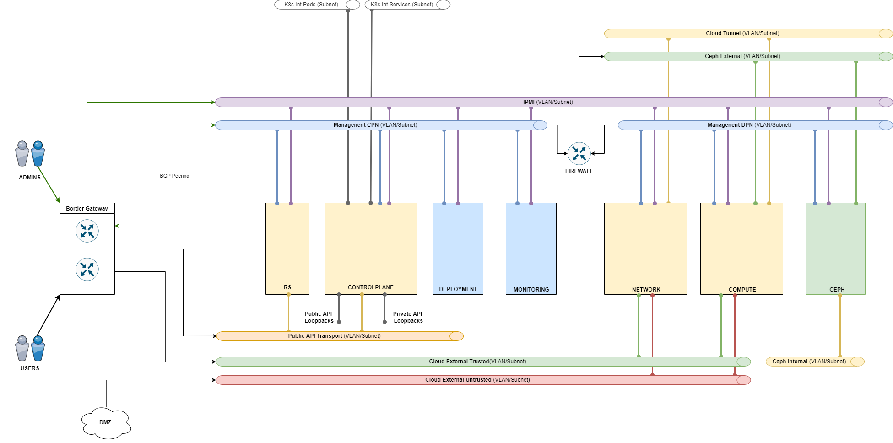

# {heading(Вариативность проектирования)[id=design_variability]}

## {heading(Основные подходы)[id=design_variability_approach]}

Проектирование установки {var(system)}, как и любой сложной системы, состоящей из многих компонентов, допускает определенные возможности по изменению их состава, объединению их на тех или иных узлах, адаптации к требованиям условий эксплуатации или запросам заказчика.

Все потенциальные изменения можно условно разделить на:

* Поддерживаемые — те, которые прошли процедуру тестирования на реализуемость, стабильность работы и соответствие предъявляемым требованиям.
* Неподдерживаемые — которые теоретически возможны, но требуют проведения полноценной процедуры тестирования.

Ниже пойдет речь только о поддерживаемых вариантах или наиболее часто упоминаемых, но еще не прошедших тестирование вариантах.

Основных причин отхода от стандартной архитектуры платформы всего две:

* Особые требования к информационной безопасности.
* Необходимость экономии оборудования.

И при любой из них настоятельно рекомендуется оставаться в пределах поддерживаемых конфигураций.

## {heading(Архитектура Keycloak)[id=design_keycloak]}

По умолчанию, Keycloak встроен в {var(system)} и выполняется на служебном кластере K8s в отказоустойчивой конфигурации. В ряде случаев заказчики предъявляют требования к отчуждению Keycloak в свою зону ответственности, за пределы {var(system)}.

Для выполнения данного требования поддерживаются два подхода:

* Использование Keycloak, предоставленного и управляемого заказчиком (рекомендуется).
* Настройка федерации Keycloak. При этом встроенный Keycloak становится ведомым относительно Keycloak заказчика (менее предпочтительный вариант).

При недоступности Keycloak возникают следующие проблемы:

* Невозможно авторизоваться в {var(system)} — недоступны все управляющие действия: как через веб-портал, так и через CLI и API.
* Возможны проблемы в работе PaaS-сервисов при обращении их к API {var(sys2)}.

## {heading(Виртуализация отдельных компонентов установки)[id=design_virtual_install_components]}

Несмотря на то, что тестовые стенды могут быть запущены целиком в виртуальной среде, для продуктивных инсталляций действуют строгие ограничения на виртуализацию компонентов, также предъявляются требования к среде виртуализации.

Следующие серверные роли могут быть размещены в виртуальной среде:

* Deploy
* Monitoring/Logging
* RS

Виртуальная среда может быть представлена:

* Специально выделенным сервером с установленным гипервизором (KVM, Standalone Hyper-V, ProxMox VE, VMware ESXi).
* Имеющейся системой виртуализации корпоративного класса (VMware vSphere/vCenter).

В обоих случаях первоначальная настройка, поддержка и обеспечение отказоустойчивости находится в зоне ответственности заказчика.

### {heading(Выделенный сервер)[id=design_dedicated_server]}

Вариант с использованием выделенного сервера (так называемого Сервисного гипервизора, Service Hypervisor) удобен для небольших инсталляций, где достаточно одного узла мониторинга — это позволяет разнести Deploy и Monitoring/Logging по двум виртуальным хостам, не увеличивая количество физических.

Также в тестовых инсталляциях можно разместить в ВМ на сервисном гипервизоре и роль RS (в единичном экземпляре). Для продуктивных инсталляций это недопустимо — не будет обеспечена отказоустойчивость RS.

### {heading(Система виртуализации)[id=design_virtual_system]}

Более сложным, но разумным подходом является размещение ВМ в имеющейся системе виртуализации. При этом будет обеспечена должная отказоустойчивость размещаемых сервисов, так как они не будут сконцентрированы на одном физическом узле.

Основным ограничивающим требованием в данном случае будет являться необходимость интеграции запускаемых ВМ в сетевую топологию облачной платформы. Строгим требованием является подача соответствующие VLAN напрямую к размещаемым ВМ (L2 связность). Только для узлов Monitoring/Logging допустима связность на уровне L3 с использованием маршрутизации.

## {heading({var(system)} и DMZ)[id=design_dmz]}

Одной из частых задач {var(system)} является организация DMZ. В данном разделе не описываются рекомендации по отделению сервисов в DMZ от публичных сетей, но даются рекомендации по проектированию таких решений.

### {heading(DMZ в рамках стандартной архитектуры)[id=design_dmz_arch]}

В случае, если требования ИБ разрешают использование Neutron для разделения трафика и в качестве межсетевого экрана, допустимо использовать стандартную архитектуру {var(system)}.

При этом будут использоваться две (или более) сети Cloud External, одна из которых будет являться «недоверенной». В проект добавляется одна из доступных внешних сетей, определяя отношение проекта к «доверенной» или «недоверенной» зоне. Для связи между проектами потребуется создание общей (shared) сети.

Межсетевой экран может быть реализован на основе Neutron (Security Groups) или с использованием внешних аппаратных решений (могут потребоваться дополнительные внешние сети), также возможно использование МСЭ в виде ВМ в {var(system)} (могут потребоваться дополнительные shared сети).

Данная архитектура является наиболее простым и экономичным решением для DMZ, но удовлетворяет лишь относительно простым требованиям ИБ.

### {heading(Архитектура DMZ с отделенным Controlplane)[id=design_dmz_controlplane]}

В качестве дополнительного средства усиления безопасности возможно выделение управляющих узлов в подсеть, отделенную аппаратным МСЭ. Для отделения сетевого трафика от управляющих узлов потребуется выделение как минимум двух узлов для роли Networking. Схема решения будет выглядеть следующим образом:

{caption(Рисунок {counter(pic)[id=numb_pic_controlplane]} — Архитектура DMZ с отделенным Controlplane)[align=center;position=under;id=pic_controlplane.png;number={const(numb_pic_controlplane)}]}

{/caption}

Такой вариант архитектуры более предпочтителен с точки зрения ИБ, но требует больший объем оборудования.

### {heading(Выделение DMZ в отдельный регион/инсталляцию)[id=design_dmz_controlplane_install]}

Наиболее радикальным с точки зрения ИБ является выделение DMZ в отдельный регион или инсталляцию. При этом в качестве базовой схемы региона DMZ рекомендуется использовать вариант с отделенным МСЭ Controlplane.

Для связи доверенной зоны и DMZ будет использоваться сеть Cloud External Trusted, зоны должны быть разделены аппаратным МСЭ. В проектах будут добавляться две внешних сети, сетью со шлюзом по умолчанию должна быть Cloud External Untrusted.

## {heading(Гиперконвергентные системы)[id=design_hyperconverged_systems]}

К гиперконвергентным системам относят реализации {var(system)}, в которых узлы гипервизоров (Compute) используются также для размещения компонентов СХД. Такая СХД может быть как основной (единственной), так и дополнительной. Возможны реализации с использованием High-IOPS или Ceph.

Оба варианта на данный момент не являются поддерживаемыми.

### {heading(High-IOPS)[id=design_high_iops]}

Интеграция High-IOPS и Compute на одном узле допустима, но на данный момент не является поддерживаемой конфигурацией.

### {heading(ceph)[id=design_ceph]}

Интеграция Ceph и Compute на одном узле допустима, но на данный момент не является поддерживаемой конфигурацией.