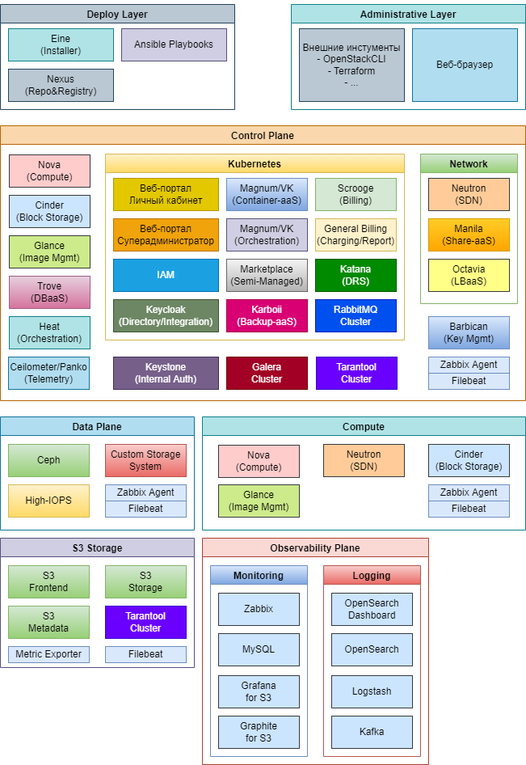

# {heading(Компоненты — списки и схемы)[id=components]}

Список компонентов {var(system)}:

* VK Eine — автоматизированный инсталлятор операционных систем.
* Ansible — система управления конфигурациями ПО. Используется для развертывания и настройки компонентов {var(sys2)}.
* Nexus — сервис репозиториев для хранения установочных пакетов и образов компонентов {var(sys2)}.
* Kubernetes — оркестратор, используемый для управления контейнерами, в которых запущена часть компонентов {var(sys2)}.
* Nova — компонент управления жизненным циклом ВМ.
* Cinder — компонент оркестрации виртуальных блочных устройств.
* Glance — компонент управления образами ВМ.
* Trove — компонент управления жизненным циклом DBaaS.
* Heat — компонент, реализующий сервис внутренней оркестрации {var(sys2)}. Используется для развертывания приложений Магазина приложений.
* Ceilometer и Panko — компоненты, отслеживающие и хранящие события жизненного цикла сущностей {var(sys2)}. Ceilometer передает информацию в биллинг, также используется для интеграции с информационными системами заказчика.
* Keystone — компонент, выполняющий аутентификацию взаимодействия между компонентами {var(sys2)}.
* Galera — СУБД, используется для хранения данных о сущностях {var(sys2)}.
* Tarantool — СУБД и платформа in-memory вычислений. Используется частью компонентов для хранения и обработки данных, в том числе хранилищем S3.
* Barbican — компонент, обеспечивающий управление жизненным циклом криптографических ключей, необходимых для внутренних нужд других компонентов {var(sys2)}, например Magnum от VK.
* Портал самообслуживания — компонент, созданный VK. Реализует веб-интерфейс для личного кабинета пользователя.
* Портал администратора — компонент, созданный VK. Реализует веб-интерфейс суперадминистратора.
* IAM — компонент, созданный VK. Отвечает за аутентификацию и авторизацию пользователей, управление правами доступа.
* Keycloak — компонент, обеспечивающий хранение учетных записей пользователей и интеграцию с внешними службами каталогов.
* Magnum от VK (Magnum/VK) — компонент, созданный VK. Реализует управление жизненным циклом сущностей Container—aaS. Также обеспечивает механизмы внутренней оркестрации сущностей.
* Marketplace — компонент, созданный VK. Реализует магазин приложений.
* Karboii — компонент, созданный VK. Отвечает за резервное копирование ВМ и СУБД (DBaaS). Обеспечивает выполнение расписания резервного копирования и стратегии хранения резервных копий.
* Scrooge — компонент, созданный VK. Отвечает за начисления и тарификацию.
* General Billing — компонент, созданный VK. Отвечает за управление балансом и генерацию отчетов по биллингу.
* Katana — компонент, созданный VK. Реализует динамическое выравнивание нагрузки на вычислительные узлы {var(sys2)}.
* RabbitMQ — брокер очередей, используемый для обмена данными между компонентами.
* Neutron — компонент, реализующий SDN (программно-определяемую сеть), используемую для предоставления сервисов виртуальной сети пользователям {var(sys2)}.
* Manila — компонент, реализующий управляемые сетевые папки с общим доступом.
* Octavia — компонент, реализующий сервис управляемых балансировщиков нагрузки.
* Ceph — программная кластеризованная СХД, используемая для хранения виртуальных дисков (volume) и образов виртуальных машин.
* High-IOPS — программная СХД на основе протокола `iSCSI` для предоставления быстрых дисков с минимальной задержкой чтения/записи. Использует для хранения данных NVMe накопители.
* Custom Storage System — предоставленная заказчиком СХД из списка поддерживаемых решений.
* S3 Frontend `*` — компонент хранилища S3 от VK, выполняющий обработку запросов к хранилищу.
* S3 Metadata `*` — компонент хранилища S3 от VK, выполняющий хранение метаданных объектов.
* S3 Storage `*` — компонент хранилища S3 от VK, выполняющий хранение размещенных в хранилище объектов.
* Zabbix — система мониторинга для контроля состояния {var(sys2)}.
* Zabbix Agent — агент сбора данных для системы мониторинга Zabbix.
* MySQL — база данных, используемая Zabbix для хранения данных.
* Grafana `*` — панель для отображения графиков системы мониторинга объектного хранилища S3 от VK.
* Graphite `*` — система мониторинга для контроля состояния объектного хранилища S3 от VK, использует собственное хранилище данных.
* Metric Exporter `*` — набор скриптов для сбора данных мониторинга из объектного хранилища S3 от VK.
* OpenSearch — система хранения и анализа логов.
* OpenSearch Dashboard — панель для работы с накопленными данными логов.
* Logstash — компонент, выполняющий нормализацию и преобразование данных логов.
* Kafka — компонент, выполняющий буферизацию при сборе данных логирования.
* Filebeat — компонент, непосредственно выполняющий сбор логов и отправку их для дальнейшей обработки.

`*` — проектирование и особенности интеграции объектного хранилища S3 от VK рассматриваются в соответствующем документе.

{caption(Рисунок {counter(pic)[id=numb_pic_cloud_platform_components]} — Компоненты {var(system)})[align=center;position=under;id=pic_cloud_platform_components;number={const(numb_pic_cloud_platform_components)}]}

{/caption}