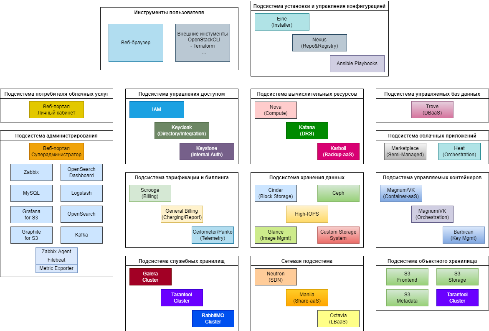
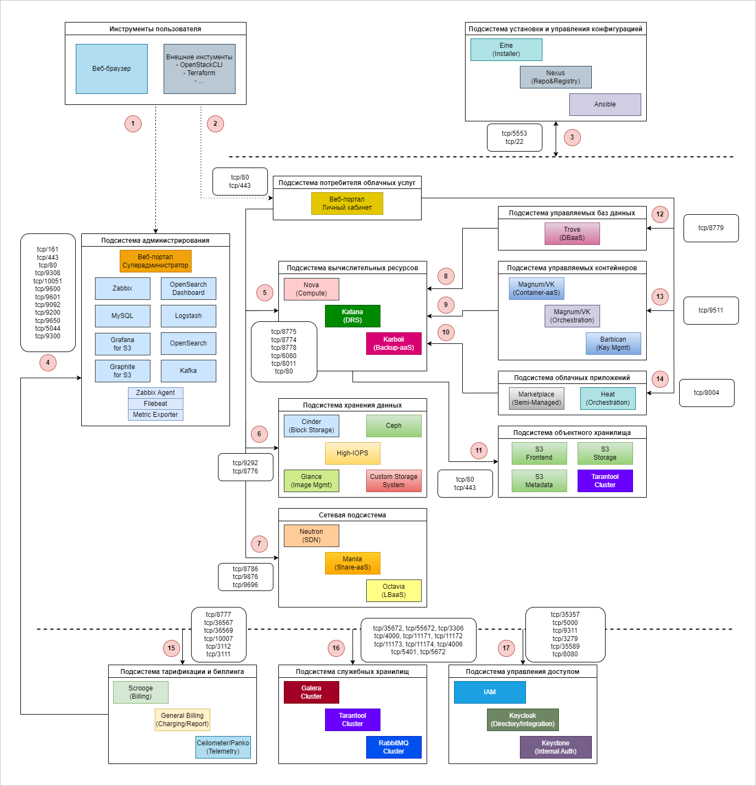

# {heading(Подсистемы — списки и схемы)[id=subsystems]}

{caption(Таблица {counter(table)[id=numb_tab_subsystems_list]} — Список подсистем {var(system)})[align=right;position=above;id=tab_subsystems_list;number={const(numb_tab_subsystems_list)}]}
[cols="1,3", options="header"]
|===
2+|Интерфейсы

|Подсистема потребителя облачных услуг
|Предназначена для предоставления графического интерфейса, позволяющего пользователю взаимодействовать со всеми подсистемами {var(sys2)}.

|Подсистема администрирования
|Предназначена для предоставления графического интерфейса, позволяющего администратору взаимодействовать со всеми подсистемами {var(sys2)}. В состав подсистемы также входят решения для мониторинга и сбора логов

|Подсистема установки и управления конфигурацией
|Предназначена для развёртывания и поддержания состояния {var(sys2)}, предоставляет инструменты развёртывания и содержит набор пакетов и образов контейнеров для настройки {var(sys2)} и работы компонентов PaaS

2+|**Общие подсистемы**

|Подсистема тарификации и биллинга
|Предназначена для сбора информации о потребляемых ресурсах и учёт использования потребляемых ресурсов {var(sys2)} с точностью до минуты по модели «Pay-As-You-Go» (биллинг по факту использования)

|Подсистема управления доступом
|Предназначена для управления учетными записями и группами пользователей, назначением ролей пользователей и синхронизации данных учетных записей с корпоративной службой каталога заказчика. Также осуществляет идентификацию, аутентификацию и авторизацию пользователей и всех смежных сервисов между собой

|Подсистема служебных хранилищ
|Предназначена для хранения данных настроек {var(sys2)}, информации о ВМ и других внутренних данных {var(sys2)}

2+|**Группа подсистем IaaS**

|Подсистема вычислительных ресурсов
|Предназначена для управления вычислительными узлами {var(sys2)} и виртуальными машинами

|Подсистема хранения данных
|Предназначена для оркестрации конечных решений по блочному хранению данных и хранения образов операционных систем

|Сетевая подсистема
|Предназначена для реализации и управления всеми аспектами виртуальной сетевой инфраструктуры

2+|**Группа подсистем PaaS/SaaS**

|Подсистема управляемых баз данных
|Предназначена для автоматизации развёртывания СУБД

|Подсистема управляемых контейнеров
|Предназначена для автоматизации управления кластерами вычислительных контейнеров Kubernetes

|Подсистема облачных приложений (Marketplace)
|Предназначена для автоматизации развёртывания типовых приложений в {var(sys3)}

|Подсистема объектного хранилища
|Предназначена для оркестрации хранения данных в объектном формате с доступом по протоколу S3.

<info>

Проектирование и особенности интеграции объектного хранилища S3 от VK рассматриваются в соответствующем документе.

</info>
|===
{/caption}

{caption(Рисунок {counter(pic)[id=numb_pic_cloud_platform_components_subsystem]} — Схема компонентов {var(system)} по подсистемам)[align=center;position=under;id=pic_cloud_platform_components_subsystem;number={const(numb_pic_cloud_platform_components_subsystem)}]}

{/caption}

{caption(Рисунок {counter(pic)[id=numb_pic_subsystems_interaction]} — Схема взаимодействия подсистем {var(system)})[align=center;position=under;id=pic_subsystems_interaction;number={const(numb_pic_subsystems_interaction)}]}

{/caption}

На рисунке выше представлена структурная схема {var(system)}.

Описание информационных потоков:

1. Передача управляющих сигналов от администратора и уведомления администратора о состоянии компонентов {var(system)}. Управление {var(system)} происходит через модуль администрирования, который содержит следующие структурные блоки:

   * Портал администратора
   * Сервис мониторинга и логирования (Zabbix + OpenSearch + Logstash + Kafka)

   Управление {var(system)} осуществляется посредством веб-браузера или Terraform и Openstack CLI через серверы слоя управления по следующим протоколам и портам: `tcp/80`, `tcp/443`.
   
   Мониторинг и получение уведомлений о состоянии {var(system)} осуществляется также посредством веб-браузера через серверы слоя мониторинга и логирования по следующим протоколам и портам: `tcp/80`, `tcp/443`.

1. Передача управляющих сигналов конечных пользователей {var(system)}.

   Управление ресурсами в рамках собственных проектов конечных пользователей происходит посредством веб-браузера и модуля потребителя облачных услуг через серверы управляющего слоя по следующим протоколам и портам: `tcp/80`, `tcp/443`.

1. Передача управляющих сигналов от администратора из модуля установки и управления конфигурациями.

   Управление установкой {var(system)} и управление его конфигурациями осуществляется на основе компонента Eine. Данный компонент находится на серверах развёртывания. Доступ к серверам {var(system)} с сервера развёртывания осуществляется по протоколу SSH (`tcp/22`). Серверы {var(system)} при необходимости получают артефакты для установки программного обеспечения, обращаясь к Nexus хранилищу по протоколу `tcp/5553`.

1. Передача информации между модулем тарификации и биллинга и модулем администрирования.

   Модуль тарификации и биллинга передаёт всю необходимую информацию для учета ресурсов в модуль администрирования по 
 протоколам из таблицы ниже:

   {caption(Таблица {counter(table)[id=numb_tab_subsystems_protocol]} — Протоколы для передачи информации)[align=right;
 position=above;id=tab_subsystems_protocol;number={const(numb_tab_subsystems_protocol)}]}

   |Узел |Приложение |Протокол | Порт   |
   |-------|------------|--------|------------| 
   |cpn/public haproxy	haproxy	TCP	80,443 |haproxy |TCP | 80,443 |
   |lm/nginx |opensearch, zabbix |TCP | 80,443 |
   |lm |snmpd |UDP | 161    |
   |lm |logstash |TCP | 5044   |
   |lm |kafka |TCP | 9092   |
   |lm |opensearch |TCP | 9200   |
   |lm |opensearch |TCP | 9300   |
   |lm |kafka_exporter |TCP | 9308   |
   |lm |logstash |TCP | 9600   |
   |lm |opensearch |TCP | 9601   |
   |lm |opensearch |TCP | 9650   |
   |lm |zabbix_server |TCP | 10051  |

   {/caption}

1. Передача информации между модулем потребителя облачных услуг и модулем вычислительных ресурсов.

   Модуль потребителя облачных услуг для работы с ВМ и системой DRS Katana обращается в модуль вычислительных ресурсов по портам из таблицы ниже:

   {caption(Таблица {counter(table)[id=numb_tab_subsystems_port]} — Порты для работы с системой)[align=right;position=above;id=tab_subsystems_port;number={const(numb_tab_subsystems_port]}

   |Узел   |Приложение   |Протокол   |Порт |
   |-------|------------|------------|------------| 
   |cpn/private haproxy   |katana   |TCP   |80 |
   |cpn/public haproxy   |novnc_proxy_cluster   |TCP   |6080 |
   |cpn/private haproxy   |karboii-karti   |TCP   |8011 |
   |cpn/private и public haproxy   |nova_compute_api_cluster   |TCP   |8774 |
   |cpn/private haproxy   |nova_metadata_api_cluster   |TCP   |8775 |
   |cpn/private haproxy   |nova_placement_api_cluster   |TCP   |8778   |

   {/caption}

1. Передача информации между модулем потребителя облачных услуг и модулем хранения данных.

   Модуль потребителя облачных услуг для работы с дисками и единицами хранения обращается в модуль хранения данных по протоколам и портам из таблицы ниже:

   {caption(Таблица {counter(table)[id=numb_tab_subsystems_port_disk]} — Протоколы и порты для работы с дисками и единицами хранения)[align=right;position=above;id=tab_subsystems_port;number={const(numb_tab_subsystems_port_disk)}]}

   |Узел   |Приложение   |Протокол   |Порт |
   |-------|------------|------------|------------| 
   |cpn/private и public haproxy   |cinder_api_cluster   |TCP   |8776 |
   |cpn/private и public haproxy   |glance_api_cluster   |TCP   |9292   |

   {/caption}

   По этим же протоколам и портам обращается модуль вычислительных ресурсов для управления жизненным циклом дисков виртуальных машин.

1. Передача информации между модулем потребителя облачных услуг и сетевым модулем.

   Модуль потребителя облачных услуг для управления виртуальной сетевой инфраструктурой, файловыми виртуальными серверами NFS/CIFS и балансировщиками обращается к сетевому компоненту по протоколам и портам из таблицы ниже:

   {caption(Таблица {counter(table)[id=numb_tab_subsystems_port_managed]} — Протоколы и порты для управления)[align=right;position=above;id=tab_subsystems_port_managed;number={const(numb_tab_subsystems_port_managed)}]}

   |Узел   |Приложение   |Протокол   |Порт |
   |-------|------------|------------|------------| 
   |cpn/private и public haproxy   |manila_api_cluster  |TCP   |8786 |
   |cpn/private и public haproxy   |neutron_api_cluster-frontend   |TCP   |9696 |
   |cpn/private и public haproxy   |octavia_cluster   |TCP   |9876   |

   {/caption}

   Для управления жизненным циклом сетевых подключений виртуальных машин модуль вычислительных ресурсов обращается к neutron по порту `tcp/9696`.

1. Передача информации между модулем управляемых баз данных и модулем вычислительных ресурсов.

   Модуль управляемых баз данных для получения виртуальных машин, на которых будут развёрнуты базы данных, обращается к модулю вычислительных ресурсов по протоколам и портам из таблицы ниже:

   {caption(Таблица {counter(table)[id=numb_tab_subsystems_port_bd]} — Протоколы и порты для получения ВМ, на которых будут развёрнуты БД)[align=right;position=above;id=tab_subsystems_port_bd;number={const(numb_tab_subsystems_port_bd)}]}

   |Узел   |Приложение  |Протокол   |Порт |
   |-------|------------|------------|------------| 
   |cpn/private haproxy   |karboii-karti   |TCP   |8011 |
   |cpn/private и public haproxy   |nova_compute_api_cluster   |TCP   |8774 |
   |cpn/private haproxy   |nova_metadata_api_cluster   |TCP   |8775 |
   |cpn/private haproxy   |nova_placement_api_cluster   |TCP   |8778   |

   {/caption}

1. Передача информации между модулем управляемых контейнеров и модулем вычислительных ресурсов.

   Модуль управляемых контейнеров для получения ВМ, на которых будут развёрнуты k8s-кластеры, обращается к модулю вычислительных ресурсов по протоколам и портам из таблицы ниже:

   {caption(Таблица {counter(table)[id=numb_tab_subsystems_port_k8s]} — Протоколы и порты для получения ВМ, на которых будут развёрнуты k8s)[align=right;position=above;id=tab_subsystems_port_k8s;number={const(numb_tab_subsystems_port_k8s)}]}
   
   |Узел   |Приложение   |Протокол   |Порт |
   |-------|------------|------------|------------| 
   |cpn/private haproxy   |karboii-karti   |TCP   |8011 |
   |cpn/private и public haproxy   |nova_compute_api_cluster   |TCP   |8774 |
   |cpn/private haproxy   |nova_metadata_api_cluster   |TCP   |8775 |
   |cpn/private haproxy   |nova_placement_api_cluster   |TCP   |8778   |

   {/caption}

1. Передача информации между модулем облачных приложений и модулем вычислительных ресурсов.

   Модуль облачных приложений для получения виртуальных машин, на которых будут развёрнуты облачные приложения из маркетплейса, обращается к компоненту вычислительных ресурсов по протоколам и портам из таблицы ниже:

   {caption(Таблица {counter(table)[id=numb_tab_subsystems_port_vm]} — Протоколы и порты для получения ВМ (облачные приложения из маркетплейса))[align=right;position=above;id=tab_subsystems_port_vm;number={const(numb_tab_subsystems_port_vm)}]}

   |Узел   |Приложение   |Протокол   |Порт |
   |-------|------------|------------|------------|
   |cpn/private haproxy   |karboii-karti   |TCP   |8011 |
   |cpn/private и public haproxy   |nova_compute_api_cluster   |TCP   |8774 |
   |cpn/private haproxy   |nova_metadata_api_cluster   |TCP   |8775 |
   |cpn/private haproxy   |nova_placement_api_cluster   |TCP   |8778   |

   {/caption}

1. Передача информации между модулем вычислительных ресурсов и объектным хранилищем.

   Для организации резервного копирования модуль вычислительных ресурсов обращается в объектное хранилище S3 по протоколам и портам из таблицы ниже:

   {caption(Таблица {counter(table)[id=numb_tab_subsystems_port_backup]} — Протоколы и порты для организации резервного копирования)[align=right;position=above;id=tab_subsystems_port_backup;number={const(numb_tab_subsystems_port_backup)}]}

   |Узел   |Приложение   |Протокол   |Порт |
   |-------|------------|------------|------------|
   |s3/front   |s3   |TCP   |80,443   |

   {/caption}

1. Передача информации между модулем потребителя облачных услуг и модулем управляемых БД.

   Модуль потребителя облачных услуг для управления жизненным циклом базы данных обращается в модуль управляемых баз данных по протоколам и портам из таблицы ниже:

   {caption(Таблица {counter(table)[id=numb_tab_subsystems_port_lifecyclical_bd]} — Протоколы и порты для управления жизненным циклом БД)[align=right;position=above;id=tab_subsystems_port_lifecyclical;number={const(numb_tab_subsystems_port_lifecyclical_bd)}]}

   |Узел   |Приложение   |Протокол   |Порт |
   |-------|------------|------------|------------|
   |cpn/private haproxy   |trove-frontend   |TCP   |8779   |

   {/caption}

1. Передача информации между модулем потребителя облачных услуг и модулем управляемых контейнеров.

   Модуль потребителя облачных услуг для управления жизненным циклом кластера контейнеров k8s обращается в модуль управляемых контейнеров по протоколам и портам из таблицы ниже:

   {caption(Таблица {counter(table)[id=numb_tab_subsystems_port_lifecyclical_k8s]} — Протоколы и порты для управления жизненным циклом кластера)[align=right;position=above;id=tab_subsystems_port_lifecyclical_k8s;number={const(numb_tab_subsystems_port_lifecyclical_k8s)}]}

   |Узел   | Приложение |Протокол   |Порт |
   |-------|------------|------------|------------|
   |cpn/private haproxy   |magnum-frontend   |TCP   |9511   |

   {/caption}

1. Передача информации между модулем потребителя облачных услуг и модулем облачных приложений.

   Модуль потребителя облачных услуг для создания приложения из маркетплейса обращается в модуль облачных приложений по протоколам и портам из таблицы ниже:

   {caption(Таблица {counter(table)[id=numb_tab_subsystems_port_marketplace]} — Протоколы и порты для создания приложения из маркетплейса)[align=right;position=above;id=tab_needs_id;number={const(numb_tab_subsystems_port_marketplace)}]}

   |Узел   |Приложение   |Протокол   |Порт |
   |-------|------------|------------|------------|
   |cpn/private haproxy   |heat-frontend   |TCP   |8004 |
   
   {/caption}

1. Передача информации для модуля тарификации и биллинга.

   Передача информации от всех компонентов {var(system)} в модуль тарификации и биллинга происходит по протоколам и портам из таблицы ниже:

   {caption(Таблица {counter(table)[id=numb_tab_subsystems_port_info]} — Протоколы и порты для передачи информации)[align=right;position=above;id=tab_subsystems_port_info;number={const(numb_tab_subsystems_port_info)}]}

   |Узел   |Приложение   |Протокол   |Порт |
   |-------|------------|------------|------------|   
   |cpn/private haproxy   |scrooge_usage_api   |TCP   |3111 |
   |cpn/private haproxy   |scrooge_price_api   |TCP   |3112 |
   |cpn/private haproxy   |panko_cluster   |TCP   |8777 |
   |cpn/private haproxy   |mcs-gb-api-frontend   |TCP   |10007 |
   |cpn/private haproxy   |billing_cluster   |TCP   |36567 |
   |cpn/private haproxy   |billing_httpd_cluster   |TCP   |36569 |
   
   {/caption}

1. Передача информации для модуля служебных хранилищ.

   Информационные потоки от всех модулей подсистемы в модуль служебных хранилищ связаны по протоколам и портам из таблицы ниже:

   {caption(Таблица {counter(table)[id=numb_tab_subsystems_port_filestorage]} — Протоколы и порты для передачи информации для модуля служебных хранилищ)[align=right;position=above;id=tab_subsystems_port_filestorage;number={const(numb_tab_subsystems_port_filestorage)}]}

   |Узел   |Приложение   |Протокол   | Порт   |
   |-------|------------|--------|------------|   
   |cpn/proxysql   |galera   |TCP   | 3306   |
   |cpn/k8s   |rabbitmq   |TCP   | 5672   |
   |cpn   |tarantool   |TCP   | 4000   |
   |cpn   |tarantool   |TCP   | 4006   |
   |cpn   |tarantool   |TCP   | 5401   |
   |cpn   |tarantool   |TCP   | 11171  |
   |cpn   |tarantool   |TCP   | 11172  |
   |cpn   |tarantool   |TCP   | 11173  |
   |cpn   |tarantool   |TCP   |11174 |
   |cpn/public и private haproxy    |trove_rabbitmq   |TCP   |35672 |
   |cpn/public и private haproxy   |trove_rabbit   |TCP   |55672 |

   {/caption}

1. Передача информации для модуля управления доступом.

   Информационные потоки от всех модулей {var(system)} в модуль управления доступом связаны по протоколам и портам из таблицы ниже:

   {caption(Таблица {counter(table)[id=numb_tab_subsystems_port_access]} — Протоколы и порты от всех модулей в модуль управления доступом)[align=right;position=above;id=tab_subsystems_port_access;number={const(numb_tab_subsystems_port_access)}]}

   | Узел               | Приложение | Протокол   | Порт       |
   |--------------------|------------|------------|------------|
   | cpn/private proxy  | policy                 | TCP        | 3279       |
   | cpn/public proxy   | keystone               | TCP        | 5000       |
   | cpn/private proxy  | keycloak               | TCP        | 8080       |
   | cpn/public proxy   | barbican               | TCP        | 9311       |
   | cpn/public proxy   | keystone_admin_cluster | TCP        | 35357      |
   | cpn/public proxy   | keystone_frontend_mcs  | TCP        | 35589      | 

   {/caption}