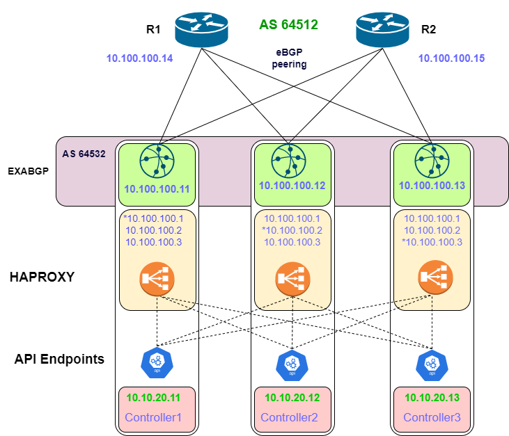
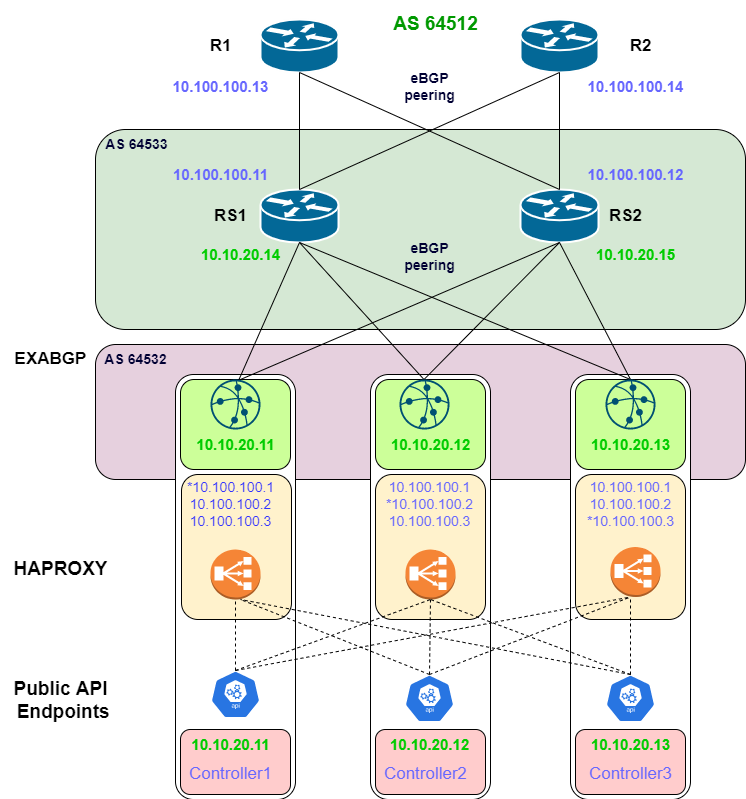

# {heading(Типовые схемы подключения к корпоративной сети)[id=connection_schemas]}

<!--- // вставить номера рисунков на отсылках -->

На рисунке ниже представлена типовая схема #1 для интеграции с корпоративной сетью передачи данных по протоколу `BGP` без использования узлов RS с установлением `eBGP` соседства между `ExaBGP` демонами и пограничными маршрутизаторами:

{caption(Рисунок {counter(pic)[id=numb_pic_typical_integration]} — Типовая схема #1 интеграции с КСПД по протоколу BGP (публичный API) без RS)[align=center;position=under;id=pic_typical_integration;number={const(numb_pic_typical_integration)}]}

{/caption}

Схема может быть расширена и представлена как типовая схема #2  для интеграции с корпоративной сетью передачи данных по протоколу BGP для анонсирования адресов публичного API с использованием узлов RS в качестве BGP соседей для `ExaBGP` демонов на ControlPlane серверах:

{caption(Рисунок {counter(pic)[id=numb_pic_typical_integration_rs]} — Типовая схема #2 интеграции с КСПД по протоколу BGP (публичный API) с RS)[align=center;position=under;id=pic_typical_integration_rs;number={const(numb_pic_typical_integration_rs)}]}

{/caption}

Допускается использовать RS-узлы только для анонсов BGP-маршрутов. При этом на стыке с пограничными маршрутизаторами корпоративной сети необходимо дополнительно сделать настройку BGP для сохранения next-hop (BGP next-hop unchanged).