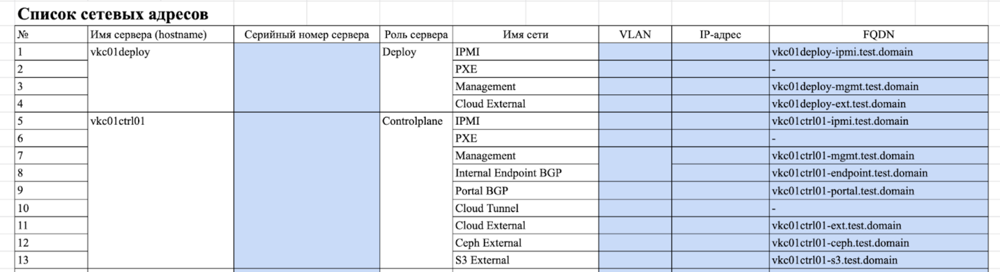

# {heading(DNS-записи)[id=dns-records]}

Для работы {var(sys2)} необходимо завести следующие DNS-записи:

* Для всех сервисов {var(sys2)} (см. {linkto(../../typical_installation/structure_requirements#dns_certs_requirements)[text=%text]}).
* Для интерфейсов всех серверов {var(sys2)}.

   Одной из задач архитектора является подготовка списка записей для заведения. Пример приведен на скриншоте.

   {caption(Рисунок {counter(pic)[id=numb_pic_addresses_list]} — Список сетевых адресов)[align=center;position=under;id=pic_addresses_list;number={const(numb_pic_addresses_list)}]}
   
   {/caption}