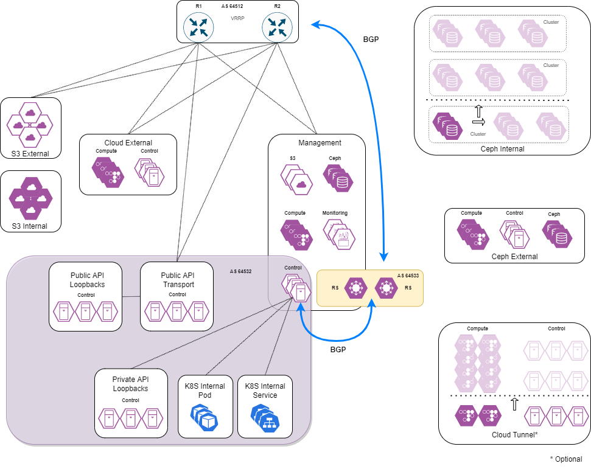
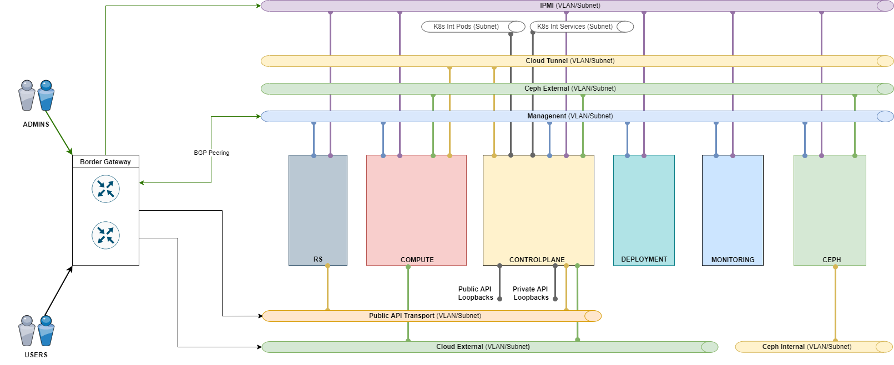
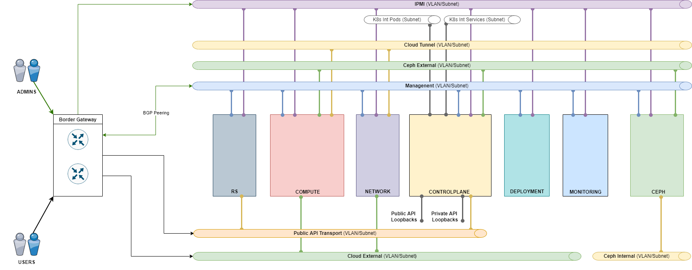

# {heading(Архитектура сети)[id=network_arch]}

{caption(Рисунок {counter(pic)[id=numb_pic_network_arch]} — Общая сетевая архитектура частного облака)[align=center;position=under;id=pic_network_arch;number={const(numb_pic_network_arch)}]}

{/caption}

{caption(Рисунок {counter(pic)[id=numb_pic_network_l2_nonet]} — Сетевая схема L2 без выделенных Network узлов)[align=center;position=under;id=pic_network_l2_nonet;number={const(numb_pic_network_l2_nonet)}]}

{/caption}

{caption(Рисунок {counter(pic)[id=numb_pic_network_l2_withnet]} — Сетевая схема L2 с выделенными Network узлами)[align=center;position=under;id=pic_network_l2_withnet]}

{/caption}

<!--- // вставить номер таблицы -->

Облачная платформа VK требует для работы набор сетей, разделенных по технологии VLAN. Они отражены на схеме, также их список приведен в таблице ниже.

{caption(Таблица {counter(table)[id=numb_tab_network_list]} — Список сетей)[align=right;position=above;id=tab_network_list;number={const(numb_tab_network_list)}]}
[cols="1,2,1,1,3", options="header"]
|===
|Название
|Описание сети
|Маска
|Доступ
|Комментарий

|Management
|Сеть для внутреннего взаимодействия компонентов платформы
|/24
|Администраторам
|Основная сеть управления. Также выполняет роль транспортной для Private API Loopback (в этой сети находятся Next hop для данных K8s и Private API)

|Private API Loopback
|Сеть для доступа компонентов к API
|/29
|Нет
|Пул loopback-адресов для HAProxy — внутренние эндпойнты, фактически три /32 префикса

|Public API Transport (Portal)
|Транспортная сеть для Public API Loopback
|/29
|Пользователям
|Выполняет роль транспортной для Public API Loopback (в этой сети находятся Next hop для Public API)

|Public API Loopback
|Сеть для доступа пользователей к порталу самообслуживания и API
|/29
|Пользователям
|Пул loopback адресов для HAProxy — внешние эндпойнты и портал, фактически три /32 префикса

|K8s Internal
|Внутреняя сеть Kubernetes
|/24
|Нет
|Резерв адресов для внутренних нужд K8s в пределах Controlplane: подсети, которые ни при каких обстоятельствах не будут конфликтовать с другими подсетями в корпоративной сети

|Cloud Tunnel
|Сеть для внутренних интерфейсов ВМ
|/24
|Нет
|Транспортная сеть для VxLAN туннелей.

|Cloud External
|Сеть для внешних интерфейсов ВМ (корпоративная сеть)
|/16
|Пользователям
|Допустимо изменение размерности в зависимости от требований заказчика к количеству Floating IPs

|Сeph External
|Сеть для доступа к данным СХД/Ceph
|/24
|Нет
|—

|Сeph Internal
|Кластерная сеть Ceph
|/24
|Нет
|—

|IPMI
|Сеть с IPMI-интерфейсами
|/24
|Администраторам
|Access Mode
|===
{/caption}

Такое разделение сетей обосновано необходимостью разделить потоки данных для обеспечения производительности и информационной безопасности платформы. Сети должны подаваться на серверы исходя из требований по пропускной способности. Например, для Compute-узлов на отдельные интерфейсы выносится сеть для связи с СХД (Ceph External), а на узлах  Ceph отдельно выносится сеть для внутреннего трафика кластера (Ceph Internal).

Состав сетей может меняться в зависимости от набора поставки {var(sys2)}. Например, при наличии соответствующих требований может быть несколько сетей Cloud External, в частности, для взаимодействия с различными производственными средами (`Dev`/`Test`/`Prod`). При этом не стоит путать раздельные сети Cloud External и наращивание емкости основной сети Cloud External с добавлением множества подсетей. Сеть Cloud Tunnel напротив является опциональной — есть смысл ее выделить, если предусмотрены отдельные физические интерфейсы для трафика виртуальных сетей, иначе разумно использовать сеть Management в качестве транспортной для этого трафика.

Размерности сетей следует выбирать исходя из планируемого роста инсталляции в ближайшие 3-5 лет (по информации заказчика). Не рекомендуется использовать размерность (маску) более /24. В случае роста инсталляции свыше возможностей, определяемых указанной размерностью, рекомендуется выделять несколько подсетей, связывая их L3-коммутатором или производительным маршрутизатором. Типы сетей окажутся теми же, но каждая будет присутствовать в двух и более экземплярах. При этом необходимо продумать топологию сети для обеспечения требуемой производительности.

<!--- // вставить номер таблицы -->

В таблице выше приведены рекомендуемые размерности сетей. Обратите внимание на основные принципы их использования:

* Сети Public API Loopback и Private API Loopback используются для выделения префиксов с маской /32 для назначения на Loopback, которые привязаны на соответствующих HAProxy. На каждую HAProxy привязывается 3 Loopback для Public API и 3 Loopback для Private API.
* Сеть Public API Transport используется для транспорта пользовательского трафика из корпоративной сети к Loopback Public API.
* Адреса из сети Public Transport API назначаются на узлах Control и узлах RS, либо если узлы RS отсутствуют в решении на роутерах корпоративной сети.
* Адреса, назначенные на Control-узлах, используются как next-hop адреса для префиксов Public API при анонсе маршрутов по BGP RS узлам или вышестоящим маршрутизаторам.

Для всех сетей требуется использование IP-адресов, уникальных в пределах корпоративной сети заказчика. В том числе и для сетей, выделенных под нужды служебного кластера K8s.